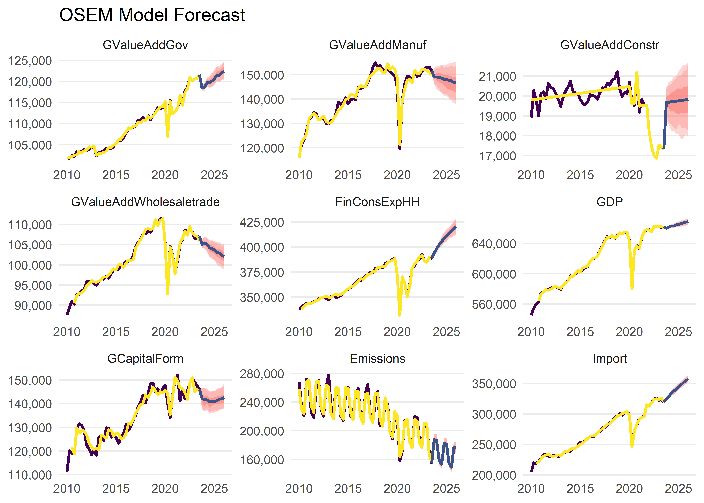

<!-- README.md is generated from README.Rmd. Please edit that file -->

# aggregate.model

<!-- badges: start -->
<!-- badges: end -->

The goal of the aggregate.model Package is to implement and
operationalise the Aggregate Model, developed by Moritz Schwarz, Jonas
Kurle, Felix Pretis, and Andrew Martinez. This is an adaptation of the
[Norwegian Aggregate Model](https://normetrics.no/nam/), developed by
Gunnar Bardsen and Ragnar Nymoen.

## Installation

You can install the development version of aggregate.model from
[GitHub](https://github.com/) with:

``` r
# install.packages("devtools")
devtools::install_github("moritzpschwarz/aggregate.model")
```

## Basic Workflow

This is an example which shows you how to run the model:

First we load the package:

``` r
library(aggregate.model)
#> Lade nötiges Paket: gets
#> Lade nötiges Paket: zoo
#> 
#> Attache Paket: 'zoo'
#> Die folgenden Objekte sind maskiert von 'package:base':
#> 
#>     as.Date, as.Date.numeric
#> Lade nötiges Paket: parallel
```

### Specify the model

The we calibrate the model specification and save this in a tibble. Here
the column names and the structure of the specification table must
follow the basic structure below.

``` r
spec <- tibble(
  type = c(
    "d",
    "d",
    "n",
    "n",
    "n",
    "n",
    "d",
    "n",
    "n",
    "d",
    "n",
    "n"
  ),
  dependent = c(
    "StatDiscrep",
    "TOTS",
    "Import",
    "FinConsExpHH",
    "GCapitalForm",
    "Emissions",
    "GDP",
    "GValueAddGov", # as in NAM, technical relationship
    "GValueAddManuf", # more complicated in NAM, see 2.3.3 and 6.3.1
    "DomDemand", # as in NAM
    "GValueAddConstr" ,
    "GValueAddWholesaletrade"
  ),
  independent = c(
    "TOTS - FinConsExpHH - FinConsExpGov - GCapitalForm - Export",
    "GValueAdd + Import",
    "FinConsExpHH + GCapitalForm",
    "",
    "FinConsExpGov",
    "GDP",
    "GValueAddGov + GValueAddAgri + GValueAddIndus + GValueAddConstr + GValueAddWholesaletrade + GValueAddInfocom + GValueAddFinance + GValueAddRealest + GValueAddResearch + GValueAddArts",
    "FinConsExpGov", # as in NAM, technical relationship
    "DomDemand + Export + LabCostManuf", # NAM uses 'export market indicator' not exports - unclear what this is, NAM uses unit labour cost in NOR manufacturing relative to the foreign price level - here is just total labour cost
    "FinConsExpHH + FinConsExpGov + GCapitalForm",
    "DomDemand + LabCostConstr + BuildingPermits", # in NAM some form of YFP2J = 0.3JBOL + 0.2JF P N + 0.3JO + 0.3JOIL. Unclear what this is. Using Building Permits instead
    "DomDemand + Export + LabCostService"
  )
)
```

To summarise this, we can print out the specification table:

<table class="table lightable-paper" style="margin-left: auto; margin-right: auto; font-family: &quot;Arial Narrow&quot;, arial, helvetica, sans-serif; margin-left: auto; margin-right: auto;">
<thead>
<tr>
<th style="text-align:left;">
type
</th>
<th style="text-align:left;">
dependent
</th>
<th style="text-align:left;">
independent
</th>
</tr>
</thead>
<tbody>
<tr>
<td style="text-align:left;">
d
</td>
<td style="text-align:left;">
StatDiscrep
</td>
<td style="text-align:left;">
TOTS - FinConsExpHH - FinConsExpGov - GCapitalForm - Export
</td>
</tr>
<tr>
<td style="text-align:left;">
d
</td>
<td style="text-align:left;">
TOTS
</td>
<td style="text-align:left;">
GValueAdd + Import
</td>
</tr>
<tr>
<td style="text-align:left;">
n
</td>
<td style="text-align:left;">
Import
</td>
<td style="text-align:left;">
FinConsExpHH + GCapitalForm
</td>
</tr>
<tr>
<td style="text-align:left;">
n
</td>
<td style="text-align:left;">
FinConsExpHH
</td>
<td style="text-align:left;">
</td>
</tr>
<tr>
<td style="text-align:left;">
n
</td>
<td style="text-align:left;">
GCapitalForm
</td>
<td style="text-align:left;">
FinConsExpGov
</td>
</tr>
<tr>
<td style="text-align:left;">
n
</td>
<td style="text-align:left;">
Emissions
</td>
<td style="text-align:left;">
GDP
</td>
</tr>
<tr>
<td style="text-align:left;">
d
</td>
<td style="text-align:left;">
GDP
</td>
<td style="text-align:left;">
GValueAddGov + GValueAddAgri + GValueAddIndus + GValueAddConstr +
GValueAddWholesaletrade + GValueAddInfocom + GValueAddFinance +
GValueAddRealest + GValueAddResearch + GValueAddArts
</td>
</tr>
<tr>
<td style="text-align:left;">
n
</td>
<td style="text-align:left;">
GValueAddGov
</td>
<td style="text-align:left;">
FinConsExpGov
</td>
</tr>
<tr>
<td style="text-align:left;">
n
</td>
<td style="text-align:left;">
GValueAddManuf
</td>
<td style="text-align:left;">
DomDemand + Export + LabCostManuf
</td>
</tr>
<tr>
<td style="text-align:left;">
d
</td>
<td style="text-align:left;">
DomDemand
</td>
<td style="text-align:left;">
FinConsExpHH + FinConsExpGov + GCapitalForm
</td>
</tr>
<tr>
<td style="text-align:left;">
n
</td>
<td style="text-align:left;">
GValueAddConstr
</td>
<td style="text-align:left;">
DomDemand + LabCostConstr + BuildingPermits
</td>
</tr>
<tr>
<td style="text-align:left;">
n
</td>
<td style="text-align:left;">
GValueAddWholesaletrade
</td>
<td style="text-align:left;">
DomDemand + Export + LabCostService
</td>
</tr>
</tbody>
</table>

In order to run this model, we also need a dictionary that translates
our model variables to EUROSTAT codes so that the download process can
be automated. You can either pass a new dictionary to the model
function, or you can use the built in dictionary
`aggregate.model::dict`:

<table class="table lightable-paper" style="margin-left: auto; margin-right: auto; font-family: &quot;Arial Narrow&quot;, arial, helvetica, sans-serif; margin-left: auto; margin-right: auto;">
<thead>
<tr>
<th style="text-align:left;">
eurostat_code
</th>
<th style="text-align:left;">
model_varname
</th>
<th style="text-align:left;">
full_name
</th>
<th style="text-align:left;">
dataset_id
</th>
<th style="text-align:left;">
var_col
</th>
<th style="text-align:left;">
nace_r2
</th>
<th style="text-align:left;">
cpa2_1
</th>
</tr>
</thead>
<tbody>
<tr>
<td style="text-align:left;">
TOTS
</td>
<td style="text-align:left;">
TOTS
</td>
<td style="text-align:left;">
Total Supply
</td>
<td style="text-align:left;">
NA
</td>
<td style="text-align:left;">
NA
</td>
<td style="text-align:left;">
NA
</td>
<td style="text-align:left;">
NA
</td>
</tr>
<tr>
<td style="text-align:left;">
B1GQ
</td>
<td style="text-align:left;">
GDP
</td>
<td style="text-align:left;">
Gross domestic product at market prices
</td>
<td style="text-align:left;">
namq_10_gdp
</td>
<td style="text-align:left;">
na_item
</td>
<td style="text-align:left;">
NA
</td>
<td style="text-align:left;">
NA
</td>
</tr>
<tr>
<td style="text-align:left;">
B1G
</td>
<td style="text-align:left;">
GValueAdd
</td>
<td style="text-align:left;">
Value added, gross
</td>
<td style="text-align:left;">
namq_10_a10
</td>
<td style="text-align:left;">
na_item
</td>
<td style="text-align:left;">
TOTAL
</td>
<td style="text-align:left;">
NA
</td>
</tr>
<tr>
<td style="text-align:left;">
P6
</td>
<td style="text-align:left;">
Export
</td>
<td style="text-align:left;">
Exports of goods and services
</td>
<td style="text-align:left;">
namq_10_gdp
</td>
<td style="text-align:left;">
na_item
</td>
<td style="text-align:left;">
NA
</td>
<td style="text-align:left;">
NA
</td>
</tr>
<tr>
<td style="text-align:left;">
P7
</td>
<td style="text-align:left;">
Import
</td>
<td style="text-align:left;">
Imports of goods and services
</td>
<td style="text-align:left;">
namq_10_gdp
</td>
<td style="text-align:left;">
na_item
</td>
<td style="text-align:left;">
NA
</td>
<td style="text-align:left;">
NA
</td>
</tr>
<tr>
<td style="text-align:left;">
P5G
</td>
<td style="text-align:left;">
GCapitalForm
</td>
<td style="text-align:left;">
Gross capital formation
</td>
<td style="text-align:left;">
namq_10_gdp
</td>
<td style="text-align:left;">
na_item
</td>
<td style="text-align:left;">
NA
</td>
<td style="text-align:left;">
NA
</td>
</tr>
<tr>
<td style="text-align:left;">
P3
</td>
<td style="text-align:left;">
FinConsExp
</td>
<td style="text-align:left;">
Final consumption expenditure
</td>
<td style="text-align:left;">
namq_10_gdp
</td>
<td style="text-align:left;">
na_item
</td>
<td style="text-align:left;">
NA
</td>
<td style="text-align:left;">
NA
</td>
</tr>
<tr>
<td style="text-align:left;">
P3_S13
</td>
<td style="text-align:left;">
FinConsExpGov
</td>
<td style="text-align:left;">
Final consumption expenditure of general government
</td>
<td style="text-align:left;">
namq_10_gdp
</td>
<td style="text-align:left;">
na_item
</td>
<td style="text-align:left;">
NA
</td>
<td style="text-align:left;">
NA
</td>
</tr>
<tr>
<td style="text-align:left;">
P31_S14_S15
</td>
<td style="text-align:left;">
FinConsExpHH
</td>
<td style="text-align:left;">
Household and NPISH final consumption expenditure
</td>
<td style="text-align:left;">
namq_10_gdp
</td>
<td style="text-align:left;">
na_item
</td>
<td style="text-align:left;">
NA
</td>
<td style="text-align:left;">
NA
</td>
</tr>
<tr>
<td style="text-align:left;">
YA0
</td>
<td style="text-align:left;">
StatDiscrep
</td>
<td style="text-align:left;">
Statistical discrepancy (expenditure approach)
</td>
<td style="text-align:left;">
namq_10_gdp
</td>
<td style="text-align:left;">
na_item
</td>
<td style="text-align:left;">
NA
</td>
<td style="text-align:left;">
NA
</td>
</tr>
<tr>
<td style="text-align:left;">
GHG
</td>
<td style="text-align:left;">
Emissions
</td>
<td style="text-align:left;">
Greenhouse Gas Emissions (All NACE and HH)
</td>
<td style="text-align:left;">
env_ac_aigg_q
</td>
<td style="text-align:left;">
airpol
</td>
<td style="text-align:left;">
TOTAL_HH
</td>
<td style="text-align:left;">
NA
</td>
</tr>
<tr>
<td style="text-align:left;">
LM-LCI-TOT
</td>
<td style="text-align:left;">
LabCostManuf
</td>
<td style="text-align:left;">
Manufacturing Labour cost index - Total Labour Cost
</td>
<td style="text-align:left;">
ei_lmlc_q
</td>
<td style="text-align:left;">
indic
</td>
<td style="text-align:left;">
C
</td>
<td style="text-align:left;">
NA
</td>
</tr>
<tr>
<td style="text-align:left;">
DomDemand
</td>
<td style="text-align:left;">
DomDemand
</td>
<td style="text-align:left;">
Domestic Demand
</td>
<td style="text-align:left;">
NA
</td>
<td style="text-align:left;">
NA
</td>
<td style="text-align:left;">
NA
</td>
<td style="text-align:left;">
NA
</td>
</tr>
<tr>
<td style="text-align:left;">
B1G
</td>
<td style="text-align:left;">
GValueAddManuf
</td>
<td style="text-align:left;">
Value added, gross Manufacturing
</td>
<td style="text-align:left;">
namq_10_a10
</td>
<td style="text-align:left;">
na_item
</td>
<td style="text-align:left;">
C
</td>
<td style="text-align:left;">
NA
</td>
</tr>
<tr>
<td style="text-align:left;">
B1G
</td>
<td style="text-align:left;">
GValueAddGov
</td>
<td style="text-align:left;">
Value added, gross Government
</td>
<td style="text-align:left;">
namq_10_a10
</td>
<td style="text-align:left;">
na_item
</td>
<td style="text-align:left;">
O-Q
</td>
<td style="text-align:left;">
NA
</td>
</tr>
<tr>
<td style="text-align:left;">
LM-LCI-TOT
</td>
<td style="text-align:left;">
LabCostConstr
</td>
<td style="text-align:left;">
Construction Labour cost index - Total Labour Cost
</td>
<td style="text-align:left;">
ei_lmlc_q
</td>
<td style="text-align:left;">
indic
</td>
<td style="text-align:left;">
F
</td>
<td style="text-align:left;">
NA
</td>
</tr>
<tr>
<td style="text-align:left;">
PSQM
</td>
<td style="text-align:left;">
BuildingPermits
</td>
<td style="text-align:left;">
Building permits - m^2 useful floorspace - Buildings
</td>
<td style="text-align:left;">
sts_cobp_q
</td>
<td style="text-align:left;">
indic_bt
</td>
<td style="text-align:left;">
F_CC1
</td>
<td style="text-align:left;">
CPA_F41001_41002
</td>
</tr>
<tr>
<td style="text-align:left;">
LM-LCI-TOT
</td>
<td style="text-align:left;">
LabCostService
</td>
<td style="text-align:left;">
Service Labour cost index - Total Labour Cost
</td>
<td style="text-align:left;">
ei_lmlc_q
</td>
<td style="text-align:left;">
indic
</td>
<td style="text-align:left;">
G-N
</td>
<td style="text-align:left;">
NA
</td>
</tr>
<tr>
<td style="text-align:left;">
B1G
</td>
<td style="text-align:left;">
GValueAddConstr
</td>
<td style="text-align:left;">
Value added, gross Construction
</td>
<td style="text-align:left;">
namq_10_a10
</td>
<td style="text-align:left;">
na_item
</td>
<td style="text-align:left;">
F
</td>
<td style="text-align:left;">
NA
</td>
</tr>
<tr>
<td style="text-align:left;">
B1G
</td>
<td style="text-align:left;">
GValueAddAgri
</td>
<td style="text-align:left;">
Value added, gross Agriculture
</td>
<td style="text-align:left;">
namq_10_a10
</td>
<td style="text-align:left;">
na_item
</td>
<td style="text-align:left;">
A
</td>
<td style="text-align:left;">
NA
</td>
</tr>
<tr>
<td style="text-align:left;">
B1G
</td>
<td style="text-align:left;">
GValueAddIndus
</td>
<td style="text-align:left;">
Value added, gross Industry
</td>
<td style="text-align:left;">
namq_10_a10
</td>
<td style="text-align:left;">
na_item
</td>
<td style="text-align:left;">
B-E
</td>
<td style="text-align:left;">
NA
</td>
</tr>
<tr>
<td style="text-align:left;">
B1G
</td>
<td style="text-align:left;">
GValueAddInfocom
</td>
<td style="text-align:left;">
Value added, gross Information and Communication
</td>
<td style="text-align:left;">
namq_10_a10
</td>
<td style="text-align:left;">
na_item
</td>
<td style="text-align:left;">
J
</td>
<td style="text-align:left;">
NA
</td>
</tr>
<tr>
<td style="text-align:left;">
B1G
</td>
<td style="text-align:left;">
GValueAddFinance
</td>
<td style="text-align:left;">
Value added, gross Financial Services
</td>
<td style="text-align:left;">
namq_10_a10
</td>
<td style="text-align:left;">
na_item
</td>
<td style="text-align:left;">
K
</td>
<td style="text-align:left;">
NA
</td>
</tr>
<tr>
<td style="text-align:left;">
B1G
</td>
<td style="text-align:left;">
GValueAddRealest
</td>
<td style="text-align:left;">
Value added, gross Real Estate
</td>
<td style="text-align:left;">
namq_10_a10
</td>
<td style="text-align:left;">
na_item
</td>
<td style="text-align:left;">
L
</td>
<td style="text-align:left;">
NA
</td>
</tr>
<tr>
<td style="text-align:left;">
B1G
</td>
<td style="text-align:left;">
GValueAddResearch
</td>
<td style="text-align:left;">
Value added, gross Scientific and Professional Services
</td>
<td style="text-align:left;">
namq_10_a10
</td>
<td style="text-align:left;">
na_item
</td>
<td style="text-align:left;">
M_N
</td>
<td style="text-align:left;">
NA
</td>
</tr>
<tr>
<td style="text-align:left;">
B1G
</td>
<td style="text-align:left;">
GValueAddArts
</td>
<td style="text-align:left;">
Value added, gross Arts and Entertainment
</td>
<td style="text-align:left;">
namq_10_a10
</td>
<td style="text-align:left;">
na_item
</td>
<td style="text-align:left;">
R-U
</td>
<td style="text-align:left;">
NA
</td>
</tr>
<tr>
<td style="text-align:left;">
B1G
</td>
<td style="text-align:left;">
GValueAddWholesaletrade
</td>
<td style="text-align:left;">
Value added, gross Wholesale and retail trade and Tourism
</td>
<td style="text-align:left;">
namq_10_a10
</td>
<td style="text-align:left;">
na_item
</td>
<td style="text-align:left;">
G-I
</td>
<td style="text-align:left;">
NA
</td>
</tr>
</tbody>
</table>

The last step in specifying the model is to create a filter list that
determines the country that we want to estimate this for and also which
unit we need for each variable. This, for the moment, is quite tedious,
but this will be improved in the future:

``` r
fa <- list(geo = "AT", s_adj = "SCA", unit = "CLV05_MEUR")
fb <- list(geo = "AT", s_adj = "SCA", unit = "CP_MEUR")
fc <- list(geo = "AT", unit = "THS_T")
fd <- list(geo = "AT", s_adj = "SCA")
fe <- list(geo = "AT", s_adj = "SCA", unit = "I15")
ff <- list(geo = "AT", s_adj = "SCA", unit = "I16")

filter_list <- list(
  "P7" = fa,
  "YA0" = fb,
  "P31_S14_S15" = fa,
  "P5G" = fa,
  "B1G" = fa,
  "P3_S13" = fa,
  "P6" = fa,
  "GHG" = fc,
  "B1GQ" = fa,
  "PSQM" = fe,
  "LM-LCI-TOT" = ff
)
```

### Running the model

Now we are ready to run the model with the `run_model()` function:

``` r
model_result <- run_model(
  specification = spec,
  filter_list = filter_list,
  save_to_disk = "data/use/InputData.xlsx",
  download = TRUE,
  trend = TRUE,
  max.lag = 4,
  saturation.tpval = 0.1/NROW(clean_data)
)
#> Reading cache file C:\Users\jonas\AppData\Local\Temp\RtmpKm3Iqj/eurostat/namq_10_gdp_date_code_FF.rds
#> Table  namq_10_gdp  read from cache file:  C:\Users\jonas\AppData\Local\Temp\RtmpKm3Iqj/eurostat/namq_10_gdp_date_code_FF.rds
#> Reading cache file C:\Users\jonas\AppData\Local\Temp\RtmpKm3Iqj/eurostat/namq_10_a10_date_code_FF.rds
#> Table  namq_10_a10  read from cache file:  C:\Users\jonas\AppData\Local\Temp\RtmpKm3Iqj/eurostat/namq_10_a10_date_code_FF.rds
#> Reading cache file C:\Users\jonas\AppData\Local\Temp\RtmpKm3Iqj/eurostat/env_ac_aigg_q_date_code_FF.rds
#> Table  env_ac_aigg_q  read from cache file:  C:\Users\jonas\AppData\Local\Temp\RtmpKm3Iqj/eurostat/env_ac_aigg_q_date_code_FF.rds
#> Reading cache file C:\Users\jonas\AppData\Local\Temp\RtmpKm3Iqj/eurostat/ei_lmlc_q_date_code_FF.rds
#> Table  ei_lmlc_q  read from cache file:  C:\Users\jonas\AppData\Local\Temp\RtmpKm3Iqj/eurostat/ei_lmlc_q_date_code_FF.rds
#> Reading cache file C:\Users\jonas\AppData\Local\Temp\RtmpKm3Iqj/eurostat/sts_cobp_q_date_code_FF.rds
#> Table  sts_cobp_q  read from cache file:  C:\Users\jonas\AppData\Local\Temp\RtmpKm3Iqj/eurostat/sts_cobp_q_date_code_FF.rds
#> Warning in load_or_download_variables(specification =
#> module_order_eurostatvars, : Unbalanced panel, will lose more than 20\% of data
#> when making balanced
#> 
#> --- Estimation begins ---
#> Estimating GCapitalForm = FinConsExpGov 
#> Estimating GValueAddGov = FinConsExpGov 
#> Estimating FinConsExpHH =  
#> Estimating Import = FinConsExpHH + GCapitalForm 
#> Constructing DomDemand = FinConsExpHH + FinConsExpGov + GCapitalForm 
#> Constructing TOTS = GValueAdd + Import 
#> Estimating GValueAddManuf = DomDemand + Export + LabCostManuf 
#> Estimating GValueAddConstr = DomDemand + LabCostConstr + BuildingPermits 
#> Estimating GValueAddWholesaletrade = DomDemand + Export + LabCostService 
#> Constructing StatDiscrep = TOTS - FinConsExpHH - FinConsExpGov - GCapitalForm - Export 
#> Constructing GDP = GValueAddGov + GValueAddAgri + GValueAddIndus + GValueAddConstr + GValueAddWholesaletrade + GValueAddInfocom + GValueAddFinance + GValueAddRealest + GValueAddResearch + GValueAddArts 
#> Estimating Emissions = GDP
```

The first time that we run this, all data will be downloaded and saved
in the folder `data/use/InputData.xlsx`.

The next time that we run the same model, we can save some time and just
load the data from our earlier run:

``` r
model_result <- run_model(
  specification = spec,
  filter_list = filter_list,
  download = FALSE,
  inputdata_directory = "data/use",
  trend = TRUE,
  max.lag = 4,
  saturation.tpval = 0.1/NROW(clean_data)
)
```

### Forecasting the model

Now that we have run the model, we can forecast the model (here using an
AR process for the exogenous values and for 10 time periods):

``` r
model_forecast <- forecast_model(model_result, n.ahead = 10, exog_fill_method = "AR", plot.forecast = FALSE)
#> No exogenous values provided. Model will forecast the exogenous values with an AR4 process (incl. Q dummies, IIS and SIS w 't.pval = 0.001').
#> Alternative is exog_fill_method = 'last'.
```

Once we are done, we can plot the forecast:

``` r
plot(model_forecast, order.as.run = TRUE)
#> Warning: Removed 3 row(s) containing missing values (geom_path).
```


