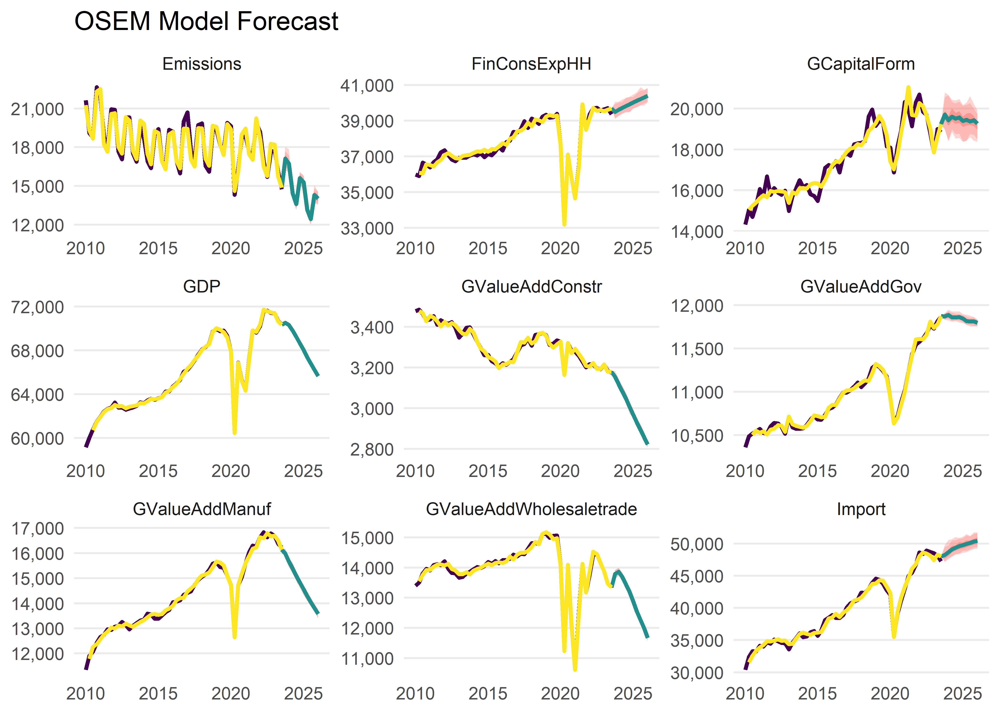

<!-- README.md is generated from README.Rmd. Please edit that file -->

# osem - Open Source Empirical Macro Model

<!-- badges: start -->

[](https://github.com/moritzpschwarz/osem/actions/workflows/R-CMD-check.yaml)
[](https://app.codecov.io/gh/moritzpschwarz/osem?branch=main)
<!-- badges: end -->

The goal of the {osem} Package is to implement and operationalise the
Open Source Empirical Macro (OSEM) Model, developed by Moritz Schwarz,
Jonas Kurle, Felix Pretis, and Andrew Martinez. This is an adaptation of
the [Norwegian Aggregate Model](https://normetrics.no/nam/), developed
by Gunnar Bardsen and Ragnar Nymoen.

## Installation

You can install the development version of {osem} from
[GitHub](https://github.com/) with:

``` r
# install.packages("devtools")
devtools::install_github("moritzpschwarz/osem")
```

## Basic Workflow

This is an example which shows you how to run the model:

First we load the package:

``` r
library(osem)
```

### Specify the model

The we calibrate the model specification and save this in a tibble. Here
the column names and the structure of the specification table must
follow the basic structure below.

``` r
spec <- dplyr::tibble(
  type = c(
    "n",
    "n",
    "n",
    "n",
    "d",
    "n",
    "n",
    "n",
    "n"
  ),
  dependent = c(
    "Import",
    "FinConsExpHH",
    "GCapitalForm",
    "Emissions",
    "GDP",
    "GValueAddGov", # as in NAM, technical relationship
    "GValueAddManuf", # more complicated in NAM, see 2.3.3 and 6.3.1
    "GValueAddConstr" ,
    "GValueAddWholesaletrade"
  ),
  independent = c(
    "FinConsExpHH + GCapitalForm",
    "",
    "FinConsExpGov + FinConsExpHH",
    "GDP + Export + GValueAddIndus",
    "GValueAddGov + GValueAddAgri + GValueAddIndus + GValueAddConstr + GValueAddWholesaletrade + GValueAddInfocom + GValueAddFinance + GValueAddRealest + GValueAddResearch + GValueAddArts",
    "FinConsExpGov", # as in NAM, technical relationship
    "Export + LabCostManuf", # NAM uses 'export market indicator' not exports - unclear what this is, NAM uses unit labour cost in NOR manufacturing relative to the foreign price level - here is just total labour cost
    "LabCostConstr + BuildingPermits", # in NAM some form of YFP2J = 0.3JBOL + 0.2JF P N + 0.3JO + 0.3JOIL. Unclear what this is. Using Building Permits instead
    "Export + LabCostService"
  ))
```

To summarise this, we can print out the specification table:

<table class="table lightable-paper" style="margin-left: auto; margin-right: auto; font-family: &quot;Arial Narrow&quot;, arial, helvetica, sans-serif; margin-left: auto; margin-right: auto;">
<thead>
<tr>
<th style="text-align:left;">
type
</th>
<th style="text-align:left;">
dependent
</th>
<th style="text-align:left;">
independent
</th>
</tr>
</thead>
<tbody>
<tr>
<td style="text-align:left;">
n
</td>
<td style="text-align:left;">
Import
</td>
<td style="text-align:left;">
FinConsExpHH + GCapitalForm
</td>
</tr>
<tr>
<td style="text-align:left;">
n
</td>
<td style="text-align:left;">
FinConsExpHH
</td>
<td style="text-align:left;">
</td>
</tr>
<tr>
<td style="text-align:left;">
n
</td>
<td style="text-align:left;">
GCapitalForm
</td>
<td style="text-align:left;">
FinConsExpGov + FinConsExpHH
</td>
</tr>
<tr>
<td style="text-align:left;">
n
</td>
<td style="text-align:left;">
Emissions
</td>
<td style="text-align:left;">
GDP + Export + GValueAddIndus
</td>
</tr>
<tr>
<td style="text-align:left;">
d
</td>
<td style="text-align:left;">
GDP
</td>
<td style="text-align:left;">
GValueAddGov + GValueAddAgri + GValueAddIndus + GValueAddConstr +
GValueAddWholesaletrade + GValueAddInfocom + GValueAddFinance +
GValueAddRealest + GValueAddResearch + GValueAddArts
</td>
</tr>
<tr>
<td style="text-align:left;">
n
</td>
<td style="text-align:left;">
GValueAddGov
</td>
<td style="text-align:left;">
FinConsExpGov
</td>
</tr>
<tr>
<td style="text-align:left;">
n
</td>
<td style="text-align:left;">
GValueAddManuf
</td>
<td style="text-align:left;">
Export + LabCostManuf
</td>
</tr>
<tr>
<td style="text-align:left;">
n
</td>
<td style="text-align:left;">
GValueAddConstr
</td>
<td style="text-align:left;">
LabCostConstr + BuildingPermits
</td>
</tr>
<tr>
<td style="text-align:left;">
n
</td>
<td style="text-align:left;">
GValueAddWholesaletrade
</td>
<td style="text-align:left;">
Export + LabCostService
</td>
</tr>
</tbody>
</table>

In order to run this model, we also need a dictionary that translates
our model variables to EUROSTAT codes so that the download process can
be automated. You can either pass a new dictionary to the model
function, or you can use the built in dictionary `osem::dict` (here the
first few rows):

<table class="table lightable-paper" style="margin-left: auto; margin-right: auto; font-family: &quot;Arial Narrow&quot;, arial, helvetica, sans-serif; margin-left: auto; margin-right: auto;">
<thead>
<tr>
<th style="text-align:left;">
model_varname
</th>
<th style="text-align:left;">
full_name
</th>
<th style="text-align:left;">
database
</th>
<th style="text-align:left;">
variable_code
</th>
<th style="text-align:left;">
dataset_id
</th>
<th style="text-align:left;">
var_col
</th>
<th style="text-align:left;">
freq
</th>
<th style="text-align:left;">
geo
</th>
<th style="text-align:left;">
unit
</th>
<th style="text-align:left;">
s_adj
</th>
<th style="text-align:left;">
nace_r2
</th>
<th style="text-align:left;">
ipcc_sector
</th>
<th style="text-align:left;">
cpa2_1
</th>
<th style="text-align:left;">
siec
</th>
</tr>
</thead>
<tbody>
<tr>
<td style="text-align:left;">
TOTS
</td>
<td style="text-align:left;">
Total Supply
</td>
<td style="text-align:left;">
NA
</td>
<td style="text-align:left;">
TOTS
</td>
<td style="text-align:left;">
NA
</td>
<td style="text-align:left;">
NA
</td>
<td style="text-align:left;">
NA
</td>
<td style="text-align:left;">
NA
</td>
<td style="text-align:left;">
NA
</td>
<td style="text-align:left;">
NA
</td>
<td style="text-align:left;">
NA
</td>
<td style="text-align:left;">
NA
</td>
<td style="text-align:left;">
NA
</td>
<td style="text-align:left;">
NA
</td>
</tr>
<tr>
<td style="text-align:left;">
GDP
</td>
<td style="text-align:left;">
Gross domestic product at market prices
</td>
<td style="text-align:left;">
eurostat
</td>
<td style="text-align:left;">
B1GQ
</td>
<td style="text-align:left;">
namq_10_gdp
</td>
<td style="text-align:left;">
na_item
</td>
<td style="text-align:left;">
q
</td>
<td style="text-align:left;">
AT
</td>
<td style="text-align:left;">
CLV05_MEUR
</td>
<td style="text-align:left;">
SCA
</td>
<td style="text-align:left;">
NA
</td>
<td style="text-align:left;">
NA
</td>
<td style="text-align:left;">
NA
</td>
<td style="text-align:left;">
NA
</td>
</tr>
<tr>
<td style="text-align:left;">
GValueAdd
</td>
<td style="text-align:left;">
Value added, gross
</td>
<td style="text-align:left;">
eurostat
</td>
<td style="text-align:left;">
B1G
</td>
<td style="text-align:left;">
namq_10_a10
</td>
<td style="text-align:left;">
na_item
</td>
<td style="text-align:left;">
q
</td>
<td style="text-align:left;">
AT
</td>
<td style="text-align:left;">
CLV05_MEUR
</td>
<td style="text-align:left;">
SCA
</td>
<td style="text-align:left;">
TOTAL
</td>
<td style="text-align:left;">
NA
</td>
<td style="text-align:left;">
NA
</td>
<td style="text-align:left;">
NA
</td>
</tr>
<tr>
<td style="text-align:left;">
Export
</td>
<td style="text-align:left;">
Exports of goods and services
</td>
<td style="text-align:left;">
eurostat
</td>
<td style="text-align:left;">
P6
</td>
<td style="text-align:left;">
namq_10_gdp
</td>
<td style="text-align:left;">
na_item
</td>
<td style="text-align:left;">
q
</td>
<td style="text-align:left;">
AT
</td>
<td style="text-align:left;">
CLV05_MEUR
</td>
<td style="text-align:left;">
SCA
</td>
<td style="text-align:left;">
NA
</td>
<td style="text-align:left;">
NA
</td>
<td style="text-align:left;">
NA
</td>
<td style="text-align:left;">
NA
</td>
</tr>
<tr>
<td style="text-align:left;">
Import
</td>
<td style="text-align:left;">
Imports of goods and services
</td>
<td style="text-align:left;">
eurostat
</td>
<td style="text-align:left;">
P7
</td>
<td style="text-align:left;">
namq_10_gdp
</td>
<td style="text-align:left;">
na_item
</td>
<td style="text-align:left;">
q
</td>
<td style="text-align:left;">
AT
</td>
<td style="text-align:left;">
CLV05_MEUR
</td>
<td style="text-align:left;">
SCA
</td>
<td style="text-align:left;">
NA
</td>
<td style="text-align:left;">
NA
</td>
<td style="text-align:left;">
NA
</td>
<td style="text-align:left;">
NA
</td>
</tr>
<tr>
<td style="text-align:left;">
GCapitalForm
</td>
<td style="text-align:left;">
Gross capital formation
</td>
<td style="text-align:left;">
eurostat
</td>
<td style="text-align:left;">
P5G
</td>
<td style="text-align:left;">
namq_10_gdp
</td>
<td style="text-align:left;">
na_item
</td>
<td style="text-align:left;">
q
</td>
<td style="text-align:left;">
AT
</td>
<td style="text-align:left;">
CLV05_MEUR
</td>
<td style="text-align:left;">
SCA
</td>
<td style="text-align:left;">
NA
</td>
<td style="text-align:left;">
NA
</td>
<td style="text-align:left;">
NA
</td>
<td style="text-align:left;">
NA
</td>
</tr>
</tbody>
</table>
<!-- The last step in specifying the model is to create a filter list that determines the country that we want to estimate this for and also which unit we need for each variable. This, for the moment, is quite tedious, but this will be improved in the future: -->
<!-- ```{r} -->
<!-- fa <- list(geo = "AT", s_adj = "SCA", unit = "CLV05_MEUR") -->
<!-- fb <- list(geo = "AT", s_adj = "SCA", unit = "CP_MEUR") -->
<!-- fc <- list(geo = "AT", unit = "THS_T") -->
<!-- fd <- list(geo = "AT", s_adj = "SCA") -->
<!-- fe <- list(geo = "AT", s_adj = "SCA", unit = "I15") -->
<!-- ff <- list(geo = "AT", s_adj = "SCA", unit = "I16") -->
<!-- filter_list <- list( -->
<!-- "P7" = fa, -->
<!-- "YA0" = fb, -->
<!-- "P31_S14_S15" = fa, -->
<!-- "P5G" = fa, -->
<!-- "B1G" = fa, -->
<!-- "P3_S13" = fa, -->
<!-- "P6" = fa, -->
<!-- "GHG" = fc, -->
<!-- "B1GQ" = fa, -->
<!-- "PSQM" = fe, -->
<!-- "LM-LCI-TOT" = ff -->
<!-- ) -->
<!-- ``` -->

### Running the model

Now we are ready to run the model with the `run_model()` function:

``` r
model_result <- run_model(
  specification = spec,
  save_to_disk = "inst/extdata/InputData.xlsx",
  primary_source = "download",
  trend = TRUE,
  saturation.tpval = 0.01
)
#> indexed 0B in  0s, 0B/sindexed 23.07MB in  0s, 115.12MB/sindexed 23.20MB in  0s, 114.89MB/sindexed 23.33MB in  0s, 114.73MB/sindexed 23.46MB in  0s, 114.76MB/sindexed 23.59MB in  0s, 114.70MB/sindexed 23.72MB in  0s, 114.74MB/sindexed 23.85MB in  0s, 114.62MB/sindexed 23.99MB in  0s, 114.64MB/sindexed 24.12MB in  0s, 114.68MB/sindexed 24.25MB in  0s, 114.79MB/sindexed 24.38MB in  0s, 114.71MB/sindexed 24.51MB in  0s, 114.58MB/sindexed 24.64MB in  0s, 114.58MB/sindexed 24.77MB in  0s, 114.59MB/sindexed 24.90MB in  0s, 114.49MB/sindexed 25.03MB in  0s, 113.89MB/sindexed 25.17MB in  0s, 113.84MB/sindexed 25.30MB in  0s, 113.71MB/sindexed 25.43MB in  0s, 113.56MB/sindexed 25.56MB in  0s, 113.48MB/sindexed 25.69MB in  0s, 113.36MB/sindexed 25.82MB in  0s, 113.26MB/sindexed 25.95MB in  0s, 113.13MB/sindexed 26.08MB in  0s, 112.99MB/sindexed 26.21MB in  0s, 112.82MB/sindexed 26.35MB in  0s, 112.70MB/sindexed 26.48MB in  0s, 112.36MB/sindexed 26.61MB in  0s, 108.20MB/sindexed 26.74MB in  0s, 108.09MB/sindexed 26.87MB in  0s, 108.04MB/sindexed 27.00MB in  0s, 107.90MB/sindexed 27.13MB in  0s, 107.45MB/sindexed 27.26MB in  0s, 107.27MB/sindexed 27.39MB in  0s, 107.16MB/sindexed 27.52MB in  0s, 107.12MB/sindexed 27.66MB in  0s, 107.07MB/sindexed 27.79MB in  0s, 107.02MB/sindexed 27.92MB in  0s, 106.98MB/sindexed 28.05MB in  0s, 106.91MB/sindexed 28.18MB in  0s, 106.86MB/sindexed 28.31MB in  0s, 106.84MB/sindexed 28.44MB in  0s, 106.80MB/sindexed 28.57MB in  0s, 106.71MB/sindexed 28.70MB in  0s, 106.49MB/sindexed 28.84MB in  0s, 106.41MB/sindexed 28.97MB in  0s, 106.32MB/sindexed 29.10MB in  0s, 106.29MB/sindexed 29.23MB in  0s, 106.24MB/sindexed 29.36MB in  0s, 106.20MB/sindexed 29.49MB in  0s, 106.16MB/sindexed 29.62MB in  0s, 106.03MB/sindexed 29.75MB in  0s, 106.08MB/sindexed 29.88MB in  0s, 106.00MB/sindexed 30.02MB in  0s, 105.92MB/sindexed 30.15MB in  0s, 105.74MB/sindexed 30.28MB in  0s, 105.57MB/sindexed 30.41MB in  0s, 105.51MB/sindexed 30.54MB in  0s, 105.49MB/sindexed 30.67MB in  0s, 105.41MB/sindexed 30.80MB in  0s, 105.44MB/sindexed 30.93MB in  0s, 105.34MB/sindexed 31.06MB in  0s, 105.32MB/sindexed 31.19MB in  0s, 105.31MB/sindexed 31.33MB in  0s, 105.30MB/sindexed 31.46MB in  0s, 105.25MB/sindexed 31.59MB in  0s, 105.25MB/sindexed 31.72MB in  0s, 105.25MB/sindexed 31.85MB in  0s, 105.06MB/sindexed 31.98MB in  0s, 105.07MB/sindexed 32.11MB in  0s, 105.08MB/sindexed 32.24MB in  0s, 105.08MB/sindexed 32.37MB in  0s, 105.10MB/sindexed 32.51MB in  0s, 105.09MB/sindexed 32.64MB in  0s, 105.08MB/sindexed 32.77MB in  0s, 105.10MB/sindexed 32.90MB in  0s, 105.10MB/sindexed 33.03MB in  0s, 105.14MB/sindexed 33.16MB in  0s, 105.05MB/sindexed 33.29MB in  0s, 105.01MB/sindexed 33.42MB in  0s, 104.97MB/sindexed 33.55MB in  0s, 104.89MB/sindexed 33.69MB in  0s, 104.89MB/sindexed 33.82MB in  0s, 104.87MB/sindexed 33.95MB in  0s, 104.88MB/sindexed 34.08MB in  0s, 104.88MB/sindexed 34.21MB in  0s, 104.90MB/sindexed 34.34MB in  0s, 104.90MB/sindexed 34.47MB in  0s, 104.89MB/sindexed 34.60MB in  0s, 104.85MB/sindexed 34.73MB in  0s, 104.85MB/sindexed 34.86MB in  0s, 104.87MB/sindexed 35.00MB in  0s, 104.82MB/sindexed 35.13MB in  0s, 104.74MB/sindexed 35.26MB in  0s, 104.66MB/sindexed 35.39MB in  0s, 104.64MB/sindexed 35.52MB in  0s, 104.65MB/sindexed 35.65MB in  0s, 104.67MB/sindexed 35.78MB in  0s, 104.69MB/sindexed 35.91MB in  0s, 104.71MB/sindexed 36.04MB in  0s, 104.67MB/sindexed 36.18MB in  0s, 104.68MB/sindexed 36.31MB in  0s, 104.68MB/sindexed 36.44MB in  0s, 104.71MB/sindexed 36.57MB in  0s, 104.74MB/sindexed 36.70MB in  0s, 104.77MB/sindexed 36.83MB in  0s, 104.64MB/sindexed 36.96MB in  0s, 104.56MB/sindexed 37.09MB in  0s, 104.56MB/sindexed 37.22MB in  0s, 104.60MB/sindexed 37.36MB in  0s, 104.58MB/sindexed 37.49MB in  0s, 104.56MB/sindexed 37.62MB in  0s, 104.55MB/sindexed 37.75MB in  0s, 104.54MB/sindexed 37.88MB in  0s, 104.55MB/sindexed 38.01MB in  0s, 104.57MB/sindexed 38.14MB in  0s, 104.58MB/sindexed 38.27MB in  0s, 104.60MB/sindexed 38.40MB in  0s, 104.64MB/sindexed 38.53MB in  0s, 104.60MB/sindexed 38.67MB in  0s, 104.41MB/sindexed 38.80MB in  0s, 104.45MB/sindexed 38.93MB in  0s, 104.41MB/sindexed 39.06MB in  0s, 104.43MB/sindexed 39.19MB in  0s, 104.50MB/sindexed 39.32MB in  0s, 104.56MB/sindexed 39.45MB in  0s, 104.40MB/sindexed 39.58MB in  0s, 104.33MB/sindexed 39.71MB in  0s, 104.35MB/sindexed 39.85MB in  0s, 104.37MB/sindexed 39.98MB in  0s, 104.34MB/sindexed 40.11MB in  0s, 104.27MB/sindexed 40.24MB in  0s, 104.21MB/sindexed 40.37MB in  0s, 104.20MB/sindexed 40.50MB in  0s, 104.20MB/sindexed 40.63MB in  0s, 104.17MB/sindexed 40.76MB in  0s, 104.17MB/sindexed 40.89MB in  0s, 104.15MB/sindexed 41.03MB in  0s, 104.15MB/sindexed 41.16MB in  0s, 104.15MB/sindexed 41.29MB in  0s, 104.17MB/sindexed 41.42MB in  0s, 104.20MB/sindexed 41.55MB in  0s, 104.19MB/sindexed 41.68MB in  0s, 104.21MB/sindexed 41.81MB in  0s, 104.20MB/sindexed 41.94MB in  0s, 104.18MB/sindexed 42.07MB in  0s, 104.11MB/sindexed 42.20MB in  0s, 104.09MB/sindexed 42.34MB in  0s, 104.07MB/sindexed 42.47MB in  0s, 103.98MB/sindexed 42.60MB in  0s, 103.97MB/sindexed 42.73MB in  0s, 103.98MB/sindexed 42.86MB in  0s, 103.97MB/sindexed 42.99MB in  0s, 103.98MB/sindexed 43.12MB in  0s, 104.00MB/sindexed 43.25MB in  0s, 104.03MB/sindexed 43.38MB in  0s, 104.02MB/sindexed 43.52MB in  0s, 103.96MB/sindexed 43.65MB in  0s, 103.92MB/sindexed 43.78MB in  0s, 103.90MB/sindexed 43.91MB in  0s, 103.89MB/sindexed 44.04MB in  0s, 103.91MB/sindexed 44.17MB in  0s, 103.90MB/sindexed 44.30MB in  0s, 103.89MB/sindexed 44.43MB in  0s, 103.89MB/sindexed 44.56MB in  0s, 101.26MB/sindexed 44.70MB in  0s, 101.27MB/sindexed 44.83MB in  0s, 101.27MB/sindexed 44.96MB in  0s, 101.31MB/sindexed 45.09MB in  0s, 101.34MB/sindexed 45.22MB in  0s, 101.37MB/sindexed 45.35MB in  0s, 101.37MB/sindexed 45.48MB in  0s, 101.40MB/sindexed 45.61MB in  0s, 101.43MB/sindexed 45.74MB in  0s, 101.43MB/sindexed 45.87MB in  0s, 101.41MB/sindexed 46.01MB in  0s, 101.39MB/sindexed 46.14MB in  0s, 101.33MB/sindexed 46.27MB in  0s, 101.31MB/sindexed 46.40MB in  0s, 101.23MB/sindexed 46.53MB in  0s, 101.23MB/sindexed 46.66MB in  0s, 101.24MB/sindexed 46.79MB in  0s, 101.22MB/sindexed 46.92MB in  0s, 101.24MB/sindexed 47.05MB in  0s, 101.25MB/sindexed 47.19MB in  0s, 101.17MB/sindexed 47.32MB in  0s, 101.16MB/sindexed 47.45MB in  0s, 101.12MB/sindexed 47.58MB in  0s, 101.03MB/sindexed 47.71MB in  0s, 101.05MB/sindexed 47.84MB in  0s, 101.08MB/sindexed 47.97MB in  0s, 101.09MB/sindexed 48.10MB in  0s, 101.10MB/sindexed 48.23MB in  0s, 101.11MB/sindexed 48.37MB in  0s, 101.13MB/sindexed 48.50MB in  0s, 101.14MB/sindexed 48.63MB in  0s, 101.16MB/sindexed 48.76MB in  0s, 101.18MB/sindexed 48.89MB in  0s, 101.21MB/sindexed 49.02MB in  0s, 101.19MB/sindexed 49.15MB in  0s, 101.14MB/sindexed 49.28MB in  0s, 101.10MB/sindexed 49.41MB in  0s, 101.02MB/sindexed 49.54MB in  0s, 100.99MB/sindexed 49.68MB in  0s, 101.00MB/sindexed 49.81MB in  0s, 101.00MB/sindexed 49.94MB in  0s, 100.97MB/sindexed 50.07MB in  0s, 100.95MB/sindexed 50.20MB in  0s, 100.94MB/sindexed 50.33MB in  0s, 100.91MB/sindexed 50.46MB in  1s, 100.90MB/sindexed 50.59MB in  1s, 100.83MB/sindexed 50.72MB in  1s, 100.79MB/sindexed 50.86MB in  1s, 100.76MB/sindexed 50.99MB in  1s, 100.78MB/s                                                                              indexed 51.12MB in  1s, 97.02MB/sindexed 51.25MB in  1s, 97.04MB/sindexed 51.38MB in  1s, 97.08MB/sindexed 51.51MB in  1s, 97.11MB/sindexed 51.64MB in  1s, 97.12MB/sindexed 51.77MB in  1s, 97.13MB/sindexed 51.90MB in  1s, 97.10MB/sindexed 52.04MB in  1s, 97.08MB/sindexed 52.17MB in  1s, 97.08MB/sindexed 52.30MB in  1s, 97.11MB/sindexed 52.43MB in  1s, 97.12MB/sindexed 52.56MB in  1s, 97.16MB/sindexed 52.69MB in  1s, 97.17MB/sindexed 52.82MB in  1s, 97.23MB/sindexed 52.95MB in  1s, 97.22MB/sindexed 53.08MB in  1s, 97.25MB/sindexed 53.21MB in  1s, 97.28MB/sindexed 53.35MB in  1s, 97.32MB/sindexed 53.48MB in  1s, 97.42MB/sindexed 53.61MB in  1s, 97.50MB/sindexed 53.74MB in  1s, 97.60MB/sindexed 53.87MB in  1s, 97.62MB/sindexed 54.00MB in  1s, 97.65MB/sindexed 54.13MB in  1s, 97.71MB/sindexed 54.26MB in  1s, 97.81MB/sindexed 54.39MB in  1s, 97.90MB/sindexed 54.53MB in  1s, 98.00MB/sindexed 54.66MB in  1s, 98.10MB/sindexed 54.79MB in  1s, 98.19MB/sindexed 54.92MB in  1s, 98.29MB/sindexed 55.05MB in  1s, 98.39MB/sindexed 55.18MB in  1s, 98.49MB/sindexed 55.31MB in  1s, 98.59MB/sindexed 55.44MB in  1s, 98.68MB/sindexed 55.57MB in  1s, 98.77MB/sindexed 55.71MB in  1s, 98.84MB/sindexed 55.84MB in  1s, 98.85MB/sindexed 55.97MB in  1s, 98.84MB/sindexed 56.10MB in  1s, 98.84MB/sindexed 56.23MB in  1s, 98.85MB/sindexed 56.36MB in  1s, 98.80MB/sindexed 56.49MB in  1s, 98.81MB/sindexed 56.62MB in  1s, 98.80MB/sindexed 56.75MB in  1s, 98.80MB/sindexed 56.88MB in  1s, 98.79MB/sindexed 57.02MB in  1s, 98.78MB/sindexed 57.15MB in  1s, 98.75MB/sindexed 57.28MB in  1s, 98.71MB/sindexed 57.41MB in  1s, 98.65MB/sindexed 57.54MB in  1s, 98.55MB/sindexed 57.67MB in  1s, 98.47MB/sindexed 57.80MB in  1s, 98.36MB/sindexed 57.93MB in  1s, 98.28MB/sindexed 58.06MB in  1s, 98.19MB/sindexed 58.20MB in  1s, 98.14MB/sindexed 58.33MB in  1s, 98.11MB/sindexed 58.46MB in  1s, 98.10MB/sindexed 58.59MB in  1s, 98.09MB/sindexed 58.72MB in  1s, 98.09MB/sindexed 58.85MB in  1s, 98.08MB/sindexed 58.98MB in  1s, 97.98MB/sindexed 59.11MB in  1s, 97.86MB/sindexed 59.24MB in  1s, 97.85MB/sindexed 59.38MB in  1s, 97.85MB/sindexed 59.51MB in  1s, 97.85MB/sindexed 59.64MB in  1s, 97.81MB/sindexed 59.77MB in  1s, 97.74MB/sindexed 59.90MB in  1s, 97.68MB/sindexed 60.03MB in  1s, 97.62MB/sindexed 60.16MB in  1s, 97.59MB/sindexed 60.29MB in  1s, 97.55MB/sindexed 60.42MB in  1s, 97.46MB/sindexed 60.55MB in  1s, 97.36MB/sindexed 60.69MB in  1s, 97.39MB/sindexed 60.82MB in  1s, 97.44MB/sindexed 60.95MB in  1s, 97.43MB/sindexed 61.08MB in  1s, 97.40MB/sindexed 61.21MB in  1s, 97.40MB/sindexed 61.34MB in  1s, 97.40MB/sindexed 61.47MB in  1s, 97.39MB/sindexed 61.60MB in  1s, 97.35MB/sindexed 61.73MB in  1s, 97.33MB/sindexed 61.87MB in  1s, 97.30MB/sindexed 62.00MB in  1s, 97.27MB/sindexed 62.13MB in  1s, 97.26MB/sindexed 62.26MB in  1s, 97.26MB/sindexed 62.39MB in  1s, 97.23MB/sindexed 62.52MB in  1s, 97.25MB/sindexed 62.65MB in  1s, 97.26MB/sindexed 62.78MB in  1s, 97.27MB/sindexed 62.91MB in  1s, 97.28MB/sindexed 63.05MB in  1s, 97.28MB/sindexed 63.18MB in  1s, 97.30MB/sindexed 63.31MB in  1s, 97.32MB/sindexed 63.44MB in  1s, 97.29MB/sindexed 63.57MB in  1s, 97.26MB/sindexed 63.70MB in  1s, 97.27MB/sindexed 63.83MB in  1s, 97.25MB/sindexed 63.96MB in  1s, 97.21MB/sindexed 64.09MB in  1s, 97.20MB/sindexed 64.22MB in  1s, 97.20MB/sindexed 64.36MB in  1s, 97.21MB/sindexed 64.49MB in  1s, 97.21MB/sindexed 64.62MB in  1s, 97.22MB/sindexed 64.75MB in  1s, 97.20MB/sindexed 64.88MB in  1s, 97.05MB/sindexed 65.01MB in  1s, 97.04MB/sindexed 65.14MB in  1s, 97.01MB/sindexed 65.27MB in  1s, 97.01MB/sindexed 65.40MB in  1s, 97.02MB/sindexed 65.54MB in  1s, 97.06MB/sindexed 65.59MB in  1s, 96.99MB/s                                                                              indexed 2.15GB in  1s, 2.15GB/s                                                                              
#> Table namq_10_gdp cached at C:\Users\morit\AppData\Local\Temp\RtmpGqc9ld/eurostat/c567619dc239cdb6c8552d73b75636ff.rds
#> indexed 0B in  0s, 0B/sindexed 2.15GB in  0s, 2.15GB/s                                                                              
#> Table env_ac_aigg_q cached at C:\Users\morit\AppData\Local\Temp\RtmpGqc9ld/eurostat/5f7391f64512e2bcd91dad03fece5d6c.rds
#> indexed 0B in  0s, 0B/sindexed 2.15GB in  0s, 2.15GB/s                                                                              
#> Table ei_lmlc_q cached at C:\Users\morit\AppData\Local\Temp\RtmpGqc9ld/eurostat/48c9e378cb4ff9a025f07c2a3c1c802b.rds
#> indexed 0B in  0s, 0B/sindexed 24.51MB in  0s, 121.93MB/sindexed 24.64MB in  0s, 121.94MB/sindexed 24.77MB in  0s, 121.74MB/sindexed 24.90MB in  0s, 121.67MB/sindexed 25.03MB in  0s, 121.58MB/sindexed 25.17MB in  0s, 115.42MB/sindexed 25.30MB in  0s, 115.22MB/sindexed 25.43MB in  0s, 115.00MB/sindexed 25.56MB in  0s, 114.91MB/sindexed 25.69MB in  0s, 114.90MB/sindexed 25.82MB in  0s, 114.87MB/sindexed 25.95MB in  0s, 114.65MB/sindexed 26.08MB in  0s, 114.65MB/sindexed 26.21MB in  0s, 114.70MB/sindexed 26.35MB in  0s, 114.50MB/sindexed 26.48MB in  0s, 114.44MB/sindexed 26.61MB in  0s, 114.40MB/sindexed 26.74MB in  0s, 114.42MB/sindexed 26.87MB in  0s, 114.29MB/sindexed 27.00MB in  0s, 114.25MB/sindexed 27.13MB in  0s, 114.16MB/sindexed 27.26MB in  0s, 114.06MB/sindexed 27.39MB in  0s, 113.99MB/sindexed 27.52MB in  0s, 114.02MB/sindexed 27.66MB in  0s, 113.78MB/sindexed 27.79MB in  0s, 113.52MB/sindexed 27.92MB in  0s, 113.35MB/sindexed 28.05MB in  0s, 113.32MB/sindexed 28.18MB in  0s, 113.24MB/sindexed 28.31MB in  0s, 113.05MB/sindexed 28.44MB in  0s, 112.77MB/sindexed 28.57MB in  0s, 112.88MB/sindexed 28.70MB in  0s, 112.63MB/sindexed 28.84MB in  0s, 112.67MB/sindexed 28.97MB in  0s, 112.64MB/sindexed 29.10MB in  0s, 112.61MB/sindexed 29.23MB in  0s, 112.59MB/sindexed 29.36MB in  0s, 112.59MB/sindexed 29.49MB in  0s, 112.57MB/sindexed 29.62MB in  0s, 112.52MB/sindexed 29.75MB in  0s, 112.35MB/sindexed 29.88MB in  0s, 112.08MB/sindexed 30.02MB in  0s, 111.88MB/sindexed 30.15MB in  0s, 111.65MB/sindexed 30.28MB in  0s, 111.48MB/sindexed 30.41MB in  0s, 111.29MB/sindexed 30.54MB in  0s, 111.04MB/sindexed 30.67MB in  0s, 110.70MB/sindexed 30.80MB in  0s, 110.52MB/sindexed 30.93MB in  0s, 110.28MB/sindexed 31.06MB in  0s, 110.23MB/sindexed 31.19MB in  0s, 110.23MB/sindexed 31.33MB in  0s, 110.15MB/sindexed 31.46MB in  0s, 109.93MB/sindexed 31.59MB in  0s, 109.87MB/sindexed 31.72MB in  0s, 109.82MB/sindexed 31.85MB in  0s, 109.70MB/sindexed 31.98MB in  0s, 109.60MB/sindexed 32.11MB in  0s, 109.51MB/sindexed 32.24MB in  0s, 109.47MB/sindexed 32.37MB in  0s, 109.44MB/sindexed 32.51MB in  0s, 109.21MB/sindexed 32.64MB in  0s, 109.08MB/sindexed 32.77MB in  0s, 108.90MB/sindexed 32.90MB in  0s, 108.73MB/sindexed 33.03MB in  0s, 108.65MB/sindexed 33.16MB in  0s, 108.31MB/sindexed 33.29MB in  0s, 108.15MB/sindexed 33.42MB in  0s, 108.02MB/sindexed 33.55MB in  0s, 107.86MB/sindexed 33.69MB in  0s, 107.59MB/sindexed 33.82MB in  0s, 107.40MB/sindexed 33.95MB in  0s, 107.41MB/sindexed 34.08MB in  0s, 107.28MB/sindexed 34.21MB in  0s, 107.26MB/sindexed 34.34MB in  0s, 107.25MB/sindexed 34.47MB in  0s, 107.25MB/sindexed 34.60MB in  0s, 107.24MB/sindexed 34.73MB in  0s, 107.22MB/sindexed 34.86MB in  0s, 107.20MB/sindexed 35.00MB in  0s, 107.15MB/sindexed 35.13MB in  0s, 107.09MB/sindexed 35.26MB in  0s, 107.03MB/sindexed 35.39MB in  0s, 107.02MB/sindexed 35.52MB in  0s, 107.04MB/sindexed 35.65MB in  0s, 107.06MB/sindexed 35.78MB in  0s, 107.14MB/sindexed 35.91MB in  0s, 107.14MB/sindexed 36.04MB in  0s, 107.14MB/sindexed 36.18MB in  0s, 107.18MB/sindexed 36.31MB in  0s, 107.19MB/sindexed 36.44MB in  0s, 107.22MB/sindexed 36.57MB in  0s, 107.23MB/sindexed 36.70MB in  0s, 107.25MB/sindexed 36.83MB in  0s, 107.20MB/sindexed 36.96MB in  0s, 107.20MB/sindexed 37.09MB in  0s, 107.18MB/sindexed 37.22MB in  0s, 107.17MB/sindexed 37.36MB in  0s, 107.18MB/sindexed 37.49MB in  0s, 107.25MB/sindexed 37.62MB in  0s, 107.27MB/sindexed 37.75MB in  0s, 107.30MB/sindexed 37.88MB in  0s, 107.35MB/sindexed 38.01MB in  0s, 107.36MB/sindexed 38.14MB in  0s, 107.37MB/sindexed 38.27MB in  0s, 107.40MB/sindexed 38.40MB in  0s, 107.41MB/sindexed 38.53MB in  0s, 107.33MB/sindexed 38.67MB in  0s, 107.33MB/sindexed 38.80MB in  0s, 107.26MB/sindexed 38.93MB in  0s, 107.22MB/sindexed 39.06MB in  0s, 107.17MB/sindexed 39.19MB in  0s, 107.18MB/sindexed 39.32MB in  0s, 107.19MB/sindexed 39.45MB in  0s, 107.21MB/sindexed 39.58MB in  0s, 107.23MB/sindexed 39.71MB in  0s, 107.25MB/sindexed 39.85MB in  0s, 107.26MB/sindexed 39.98MB in  0s, 107.28MB/sindexed 40.11MB in  0s, 107.30MB/sindexed 40.24MB in  0s, 107.22MB/sindexed 40.37MB in  0s, 107.18MB/sindexed 40.50MB in  0s, 107.03MB/sindexed 40.63MB in  0s, 107.04MB/sindexed 40.76MB in  0s, 107.06MB/sindexed 40.89MB in  0s, 107.08MB/sindexed 41.03MB in  0s, 107.08MB/sindexed 41.16MB in  0s, 107.03MB/sindexed 41.29MB in  0s, 107.00MB/sindexed 41.42MB in  0s, 106.99MB/sindexed 41.55MB in  0s, 107.00MB/sindexed 41.68MB in  0s, 107.01MB/sindexed 41.81MB in  0s, 107.04MB/sindexed 41.94MB in  0s, 107.05MB/sindexed 42.07MB in  0s, 107.02MB/sindexed 42.20MB in  0s, 107.06MB/sindexed 42.34MB in  0s, 107.04MB/sindexed 42.47MB in  0s, 107.05MB/sindexed 42.60MB in  0s, 107.09MB/sindexed 42.73MB in  0s, 107.13MB/sindexed 42.86MB in  0s, 107.18MB/sindexed 42.99MB in  0s, 107.19MB/sindexed 43.12MB in  0s, 107.21MB/sindexed 43.25MB in  0s, 107.20MB/sindexed 43.38MB in  0s, 107.16MB/sindexed 43.52MB in  0s, 107.10MB/sindexed 43.65MB in  0s, 107.08MB/sindexed 43.78MB in  0s, 107.00MB/sindexed 43.91MB in  0s, 106.93MB/sindexed 44.04MB in  0s, 106.90MB/sindexed 44.17MB in  0s, 106.96MB/sindexed 44.30MB in  0s, 107.01MB/sindexed 44.43MB in  0s, 107.08MB/sindexed 44.56MB in  0s, 107.14MB/sindexed 44.70MB in  0s, 107.20MB/sindexed 44.83MB in  0s, 107.27MB/sindexed 44.96MB in  0s, 107.34MB/sindexed 45.09MB in  0s, 107.40MB/sindexed 45.22MB in  0s, 107.44MB/sindexed 45.35MB in  0s, 107.47MB/sindexed 45.48MB in  0s, 107.56MB/sindexed 45.61MB in  0s, 107.63MB/sindexed 45.74MB in  0s, 107.71MB/sindexed 45.87MB in  0s, 107.68MB/sindexed 46.01MB in  0s, 107.72MB/sindexed 46.14MB in  0s, 107.75MB/sindexed 46.27MB in  0s, 107.78MB/sindexed 46.40MB in  0s, 107.80MB/sindexed 46.53MB in  0s, 107.83MB/sindexed 46.66MB in  0s, 107.86MB/sindexed 46.79MB in  0s, 107.88MB/sindexed 46.92MB in  0s, 107.87MB/sindexed 47.05MB in  0s, 107.77MB/sindexed 47.19MB in  0s, 107.76MB/sindexed 47.32MB in  0s, 107.76MB/sindexed 47.45MB in  0s, 103.74MB/sindexed 47.58MB in  0s, 103.74MB/sindexed 47.65MB in  0s, 103.64MB/s                                                                              indexed 2.15GB in  0s, 2.15GB/s                                                                              
#> Table namq_10_a10 cached at C:\Users\morit\AppData\Local\Temp\RtmpGqc9ld/eurostat/a48b692dcc3fb2781f39b235c4498221.rds
#> indexed 0B in  0s, 0B/sindexed 2.15GB in  0s, 2.15GB/s                                                                              
#> Table sts_cobp_q cached at C:\Users\morit\AppData\Local\Temp\RtmpGqc9ld/eurostat/747ede24fdec507eceea0e73e631fc53.rds
#> Warning in load_or_download_variables(specification = module_order, dictionary
#> = dictionary, : Unbalanced panel, will lose more than 20\% of data when making
#> balanced
#> 
#> --- Estimation begins ---
#> Estimating GValueAddGov = FinConsExpGov 
#> Estimating GValueAddManuf = Export + LabCostManuf 
#> Estimating GValueAddConstr = LabCostConstr + BuildingPermits 
#> Estimating GValueAddWholesaletrade = Export + LabCostService 
#> Estimating FinConsExpHH =  
#> Constructing GDP = GValueAddGov + GValueAddAgri + GValueAddIndus + GValueAddConstr + GValueAddWholesaletrade + GValueAddInfocom + GValueAddFinance + GValueAddRealest + GValueAddResearch + GValueAddArts 
#> Estimating GCapitalForm = FinConsExpGov + FinConsExpHH 
#> Estimating Emissions = GDP + Export + GValueAddIndus 
#> Estimating Import = FinConsExpHH + GCapitalForm
```

The first time that we run this, all data will be downloaded and saved
in the folder `data/use/InputData.xlsx`.

The next time that we run the same model, we can save some time and just
load the data from our earlier run:

``` r
model_result <- run_model(
  specification = spec,
  primary_source = "local",
  inputdata_directory = "inst/extdata",
  trend = TRUE,
  saturation.tpval = 0.01
)
```

### Forecasting the model

Now that we have run the model, we can forecast the model (here using an
AR process for the exogenous values and for 10 time periods):

``` r
model_forecast <- forecast_model(model_result, n.ahead = 10, exog_fill_method = "AR", plot.forecast = FALSE)
#> No exogenous values provided. Model will forecast the exogenous values with an AR4 process (incl. Q dummies, IIS and SIS w 't.pval = 0.001').
#> Alternative is exog_fill_method = 'last'.
```

Once we are done, we can plot the forecast:

``` r
plot(model_forecast, order.as.run = TRUE)
```


