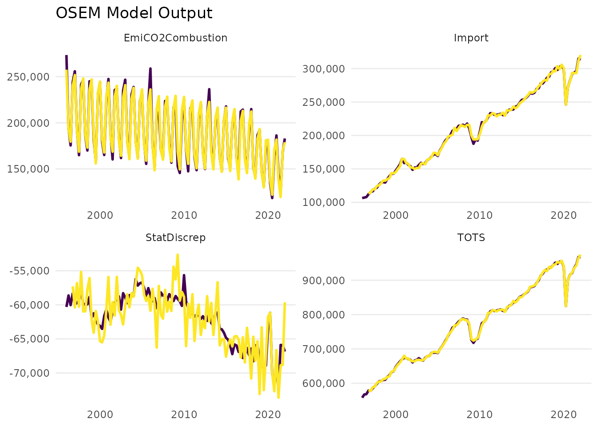
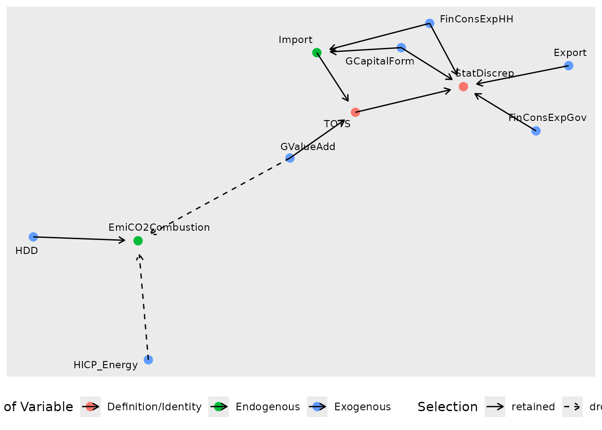
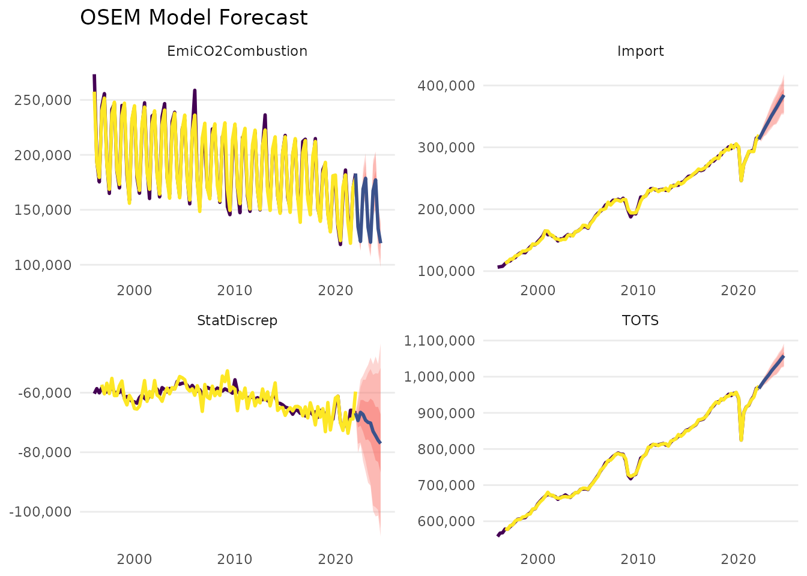

# Example Workflow

``` r
library(osem)
library(dplyr)
library(purrr)
```

## Setting up the Model

### Dictionary

In this illustration, we will rely on the default dictionary that is
available from `dict`.

``` r
dict %>% 
  select(model_varname, database, dataset_id, variable_code, freq, geo) %>% 
  head()
#> # A tibble: 6 × 6
#>   model_varname  database dataset_id variable_code freq  geo  
#>   <chr>          <chr>    <chr>      <chr>         <chr> <chr>
#> 1 Supply         NA       NA         NA            NA    NA   
#> 2 Demand         NA       NA         NA            NA    NA   
#> 3 GDPOutput      NA       NA         NA            NA    NA   
#> 4 GDPExpenditure NA       NA         NA            NA    NA   
#> 5 CO2Industry    NA       NA         NA            NA    NA   
#> 6 TOTS           NA       NA         TOTS          NA    NA
dict %>% 
  select(model_varname, database, dataset_id, variable_code, freq, geo) %>% 
  tail()
#> # A tibble: 6 × 6
#>   model_varname     database dataset_id    variable_code freq  geo  
#>   <chr>             <chr>    <chr>         <chr>         <chr> <chr>
#> 1 Gasoline_price    statcan  18-10-0001-01 NA            m     NA   
#> 2 CPI_Energy        statcan  18-10-0004-01 NA            m     NA   
#> 3 CPI_Gasoline      statcan  18-10-0004-01 NA            m     NA   
#> 4 IndProdPriceIndex statcan  18-10-0266-01 NA            m     NA   
#> 5 IndProdGDP        statcan  36-10-0434-01 NA            m     NA   
#> 6 WORLD_OIL         imf      PCPS          NA            M     NA
```

### Specification

We use a specification for illustrative purposes only. Our specification
contains the following four modules/equations:

``` r
specification <- dplyr::tibble(
    type = c(
      "d",
      "d",
      "n",
      "n"
    ),
    dependent = c(
      "StatDiscrep",
      "TOTS",
      "Import",
      "EmiCO2Combustion"
    ),
    independent = c(
      "TOTS - FinConsExpHH - FinConsExpGov - GCapitalForm - Export",
      "GValueAdd + Import",
      "FinConsExpHH + GCapitalForm",
      "HDD + HICP_Energy + GValueAdd"
    )
  )
print(specification)
#> # A tibble: 4 × 3
#>   type  dependent        independent                                            
#>   <chr> <chr>            <chr>                                                  
#> 1 d     StatDiscrep      TOTS - FinConsExpHH - FinConsExpGov - GCapitalForm - E…
#> 2 d     TOTS             GValueAdd + Import                                     
#> 3 n     Import           FinConsExpHH + GCapitalForm                            
#> 4 n     EmiCO2Combustion HDD + HICP_Energy + GValueAdd
```

The first two equations are simply accounting identities. The third
equation models imports as a function of final consumption expenditure
of households and gross capital formation. The fourth equation models
carbon emissions from combustion activities, which includes energy
industries, manufacturing and construction, transport, and combustion
activities in other sectors.The regressors are the number of heating
degree days, the harmonised index of consumer prices for energy, and
total gross value added.

### Data

We differentiate between where data can be obtained from *in principle*
versus where it should be obtained from *actually* in a specific model
run. For example, a variable that is available on Eurostat can be
downloaded from Eurostat but might have been saved locally from a
previous model run. In order to save time, the user might prefer that
the local data is used rather than re-downloading the data.

The dictionary specifies where the data for the different variables can
be obtained *in principle*. The column `dict$database` may take one of
four different values:

- `eurostat` if the variable is available from Eurostat using
  [`eurostat::get_eurostat()`](https://ropengov.github.io/eurostat/reference/get_eurostat.html),
- `edgar` if the (emissions) variable is available EDGAR using a link,
- `local` if the variable is not available from the above two sources
  and is therefore provided as a path to a local file or a (list of)
  [`data.frame()`](https://rdrr.io/r/base/data.frame.html)’s by the user
  using the `input` argument. The argument takes `.rds`, `.csv`, and
  `.xlsx` files, opens them consecutively, and searches for the
  variable.
- `NA` if the variable is constructed as an identity/definition

The argument `primary_source` in the main function
[`run_model()`](http://www.moritzschwarz.org/osem/reference/run_model.md)
governs how the data is *actually* obtained in this model run. Data that
can in principle be downloaded from `eurostat` or `edgar` can also be
loaded locally if it has been saved manually by the user or using the
`save_to_disk` argument in
[`run_model()`](http://www.moritzschwarz.org/osem/reference/run_model.md)
in a previous model run. The argument `primary_source` can take either
the value `"download"` or `"local"`, which governs whether download or
local input takes precedence for `eurostat` and `edgar` variables.

This gives rise to the following combinations of obtaining data:

- variables with `dictionary$database == "local"` are always searched
  for among the files of `input` and an error is raised if they cannot
  be found there
- variables with `dictionary$database == "eurostat"` or
  `dictionary$database == "egdar"`
  - argument `primary_source == "download"` first downloads all the
    variables (potentially updating the values) and only searches the
    local directory if the variables cannot be obtained that way
    (e.g. if there were problems with the download)
  - argument `primary_source == "local"` first searches the local
    directory and only downloads those variables that could not be found
    locally

Here, we use variables that can *in principle* all be obtained from
either Eurostat or EDGAR but we use the local file
`example-workflow-data.rds` to save time when compiling the vignette.

``` r
vars <- c("StatDiscrep", "TOTS", "Import", "EmiCO2Combustion", "FinConsExpHH",
          "FinConsExpGov", "GCapitalForm", "Export", "GValueAdd", "HDD",
          "HICP_Energy")
dict %>% 
  filter(model_varname %in% vars) %>% 
  pull(database)
#>  [1] NA         "eurostat" "eurostat" "eurostat" "eurostat" "eurostat"
#>  [7] "eurostat" "eurostat" "eurostat" "eurostat" "edgar"
```

To avoid downloading all those variables again, we will specify
`primary_source == "local"` and provide a `input` path to local files
with a path or by explicitly passing
[`data.frame()`](https://rdrr.io/r/base/data.frame.html)’s to the
function when calling
[`run_model()`](http://www.moritzschwarz.org/osem/reference/run_model.md).

## Running the Model

We are now ready to run the model and obtain an `"osem"` object.

``` r
model <- run_model(specification = specification,
                   dictionary = dict,
                   input = NULL,
                   primary_source = "local",
                   save_to_disk = "./Downloaded_Input.xlsx",
                   present = FALSE,
                   quiet = FALSE, 
                   plot = FALSE)
class(model)
```

``` r
plot(model)
```



We did not `quiet` the output, so we get some information about the
estimation.

We are told that local files are used, namely the file
`"example-workflow-data.rds"`, which can be found in our working
directory `"."` from where the vignette is created. Next, we obtain a
warning that the panel is unbalanced, which means that we have “ragged
edges” that cause more than 20% of the data to be discarded when
limiting the sample to the time periods that are available for **all**
variables.

Finally, the estimation begins. The order of the modules is determined
by how they are related to each other, starting with the modules that
only depend on exogenous (unmodelled) variables and then gradually
estimating the other modules in order to avoid any reverse dependencies.

## Evaluating the Model

Now, we can have a look at the model results.

### Individual Module Results

The different modules are stored in `model$module_collection`, which is
a tibble that stores the datasets, independent and dependent variables,
model arguments, and the model itself as an `"isat"` object.

For example, taking a closer look at the estimated module for carbon
emissions from combustion activities:

``` r
# extract the isat model object
co2module <- model$module_collection %>% 
  filter(dependent == "EmiCO2Combustion") %>% 
  pull(model) %>% 
  pluck(1)
class(co2module)
#> [1] "isat"
# inspect the estimated equation
print(co2module)
#> 
#> Date: Mon Mar 23 22:11:44 2026 
#> Dependent var.: ln.EmiCO2Combustion 
#> Method: Ordinary Least Squares (OLS)
#> Variance-Covariance: Ordinary 
#> No. of observations (mean eq.): 105 
#> Sample: 1996-01-01 to 2022-01-01 
#> 
#> SPECIFIC mean equation:
#> 
#>                      coef   std.error   t-stat   p-value    
#> mconst        11.98154443  0.09154820 130.8769 < 2.2e-16 ***
#> trend         -0.00207087  0.00011991 -17.2697 < 2.2e-16 ***
#> ln.HDD         0.06430458  0.01245560   5.1627 1.295e-06 ***
#> q_2           -0.21223350  0.01639718 -12.9433 < 2.2e-16 ***
#> q_3           -0.23504358  0.03143830  -7.4763 3.419e-11 ***
#> q_4           -0.04575356  0.00851226  -5.3750 5.274e-07 ***
#> sis2018-10-01 -0.07541015  0.01466713  -5.1414 1.416e-06 ***
#> sis2020-01-01 -0.05082377  0.01647038  -3.0858  0.002646 ** 
#> ---
#> Signif. codes:  0 '***' 0.001 '**' 0.01 '*' 0.05 '.' 0.1 ' ' 1
#> 
#> Diagnostics and fit:
#> 
#>                     Chi-sq df p-value  
#> Ljung-Box AR(1)   3.078307  1 0.07934 .
#> Ljung-Box ARCH(1) 0.006605  1 0.93523  
#> ---
#> Signif. codes:  0 '***' 0.001 '**' 0.01 '*' 0.05 '.' 0.1 ' ' 1
#>                           
#> SE of regression   0.02940
#> R-squared          0.97703
#> Log-lik.(n=105)  225.33551
```

We find that the number of heating degree days (`HDD`) and gross value
added (`GValueAdd`) are significant, while gets model selection dropped
the harmonised consumer price index for energy. Both gross value added
and heating degree days have a positive coefficient meaning that they
increase emissions, as we would expect.

Both diagnostic tests of no autocorrelation and no autoregressive
conditional heteroskedasticity pass.

### Module Network

We can show the relationship between the different modules using the
[`network()`](http://www.moritzschwarz.org/osem/reference/network.md)
function.

``` r
network(model)
```

 Each node
represents a module and the different colours represent whether the
variable is given by a definition/identity, whether it has been modelled
as an endogenous variable depending on other models, and whether it is
an exogenous variable input to the models.

An solid line arrow means that the variable has been retained during
model selection, while a dashed arrow means that the variable has been
dropped during model selection. Note again that `HICP_Energy` was in the
original specification but has been found to be insignificant.

### Forecasts

We can use our model to forecast the variables of our modules. This
works for both the definition/identity modules and the endogenous
modules. The user can either provide future values for the exogenous
variables (e.g. corresponding to certain scenario assumptions) or use
automatic AR models to forecast future values of the exogenous
variables.

``` r
forecast <- forecast_model(model = model,
                           exog_predictions = NULL,
                           plot = FALSE)
#> No exogenous values provided. Model will forecast the exogenous values with an AR4 process (incl. Q dummies, IIS and SIS w 't.pval = 0.001').
#> Alternative is exog_fill_method = 'last'.
class(forecast)
#> [1] "osem.forecast"
```

We did not specify paths for the exogenous regressors, so the output
informs us that AR(4) processes were used to project their paths. The
function returns an object of class `"osem.forecast"`, which can also be
plotted.

``` r
plot(forecast)
```



### Diagnostics

To obtain an overview of the diagnostic results for each endogenous
module, we can use the command
[`diagnostics_model()`](http://www.moritzschwarz.org/osem/reference/diagnostics_model.md).
This avoids having to look at all `"isat"` model objects manually.

``` r
diagnostics_model(model)
#> # A tibble: 2 × 8
#>   module     AR  ARCH `Super Exogeneity`   IIS   SIS     n `Share of Indicators`
#>   <chr>   <dbl> <dbl>              <dbl> <int> <int> <int>                 <dbl>
#> 1 Import 0.309  0.258           0.000186     3     1   102                0.0392
#> 2 EmiCO… 0.0793 0.935          NA            0     2   105                0.0190
```

The diagnostics pass for both modules: we neither have evidence for
autocorrelated errors nor for autoregressive conditional
heteroskedasticity.

The output also shows how many impulse indicators (representing
outliers) and step indicators (representing structural breaks of the
mean) have been retained in each module, both in absolute and as a share
of the observations.

### Shiny App

Last but not least, we can get an overview and summary of the whole OSEM
model results in a Shiny app, which can be opened using the
[`present_model()`](http://www.moritzschwarz.org/osem/reference/present_model.md)
command. The following code snippet is not executed:

``` r
present_model(model)
```
