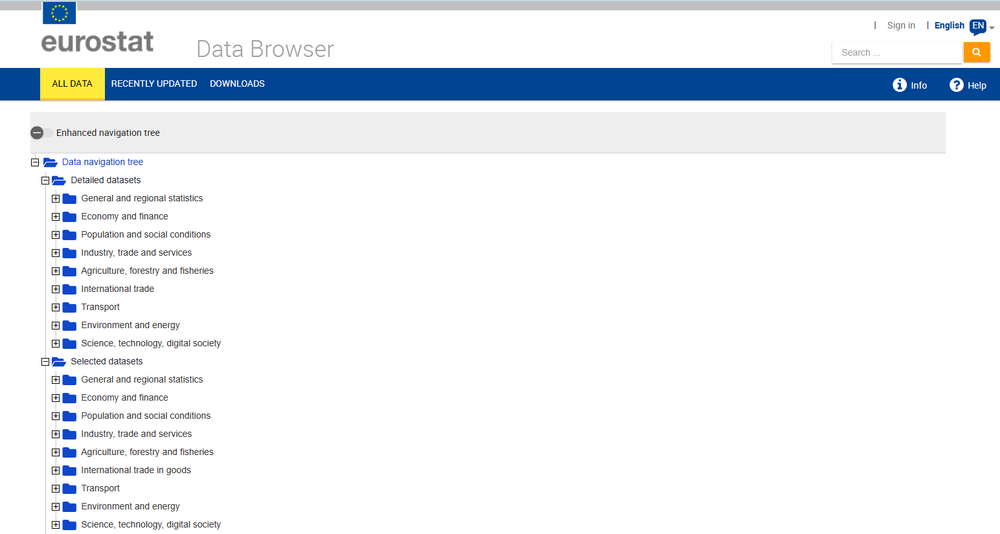
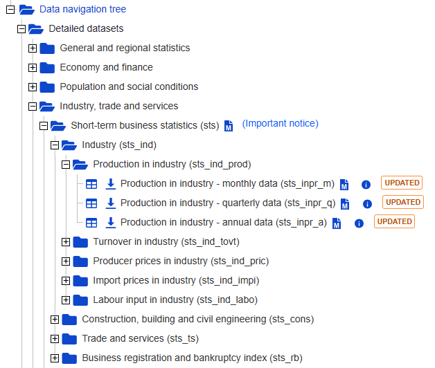
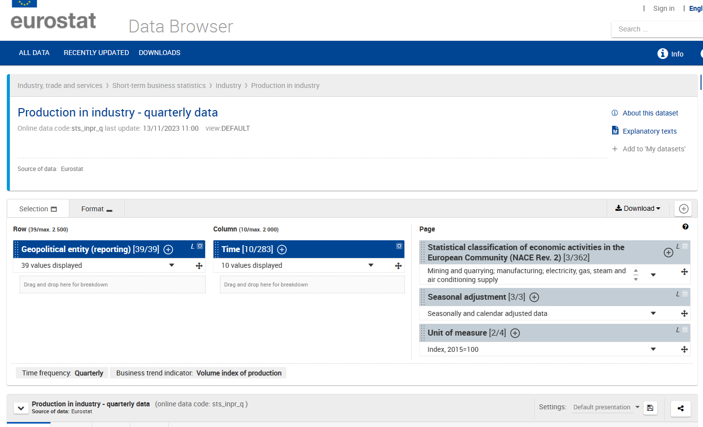
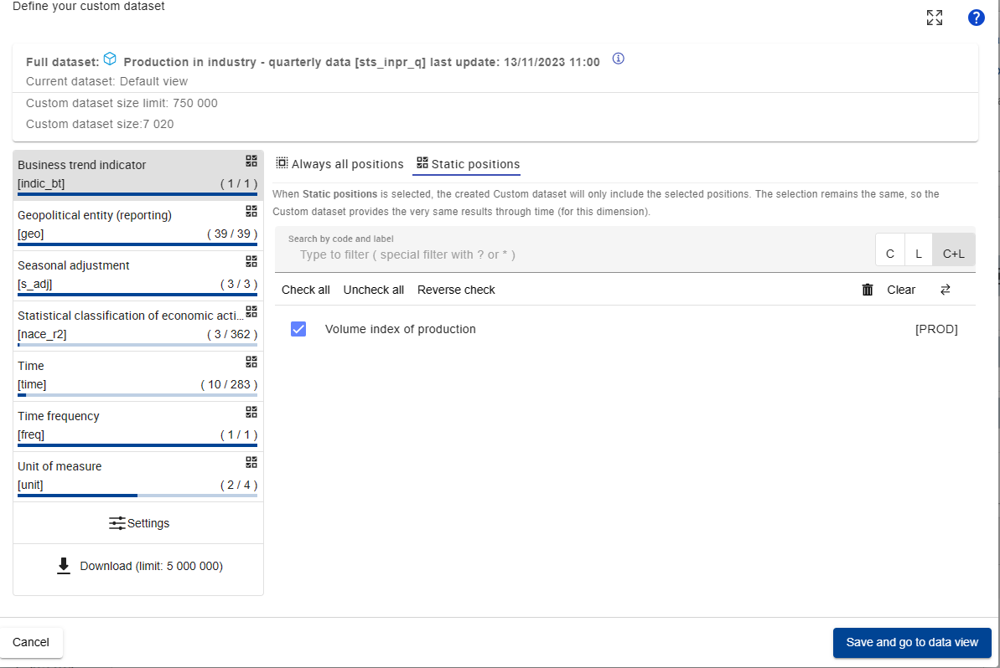
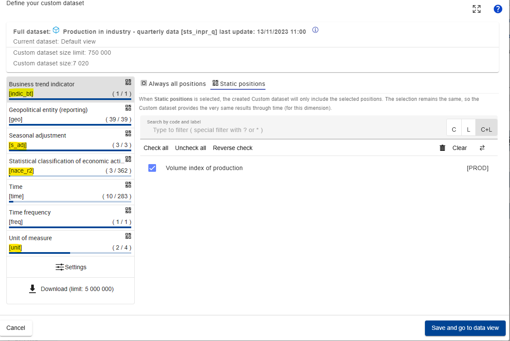
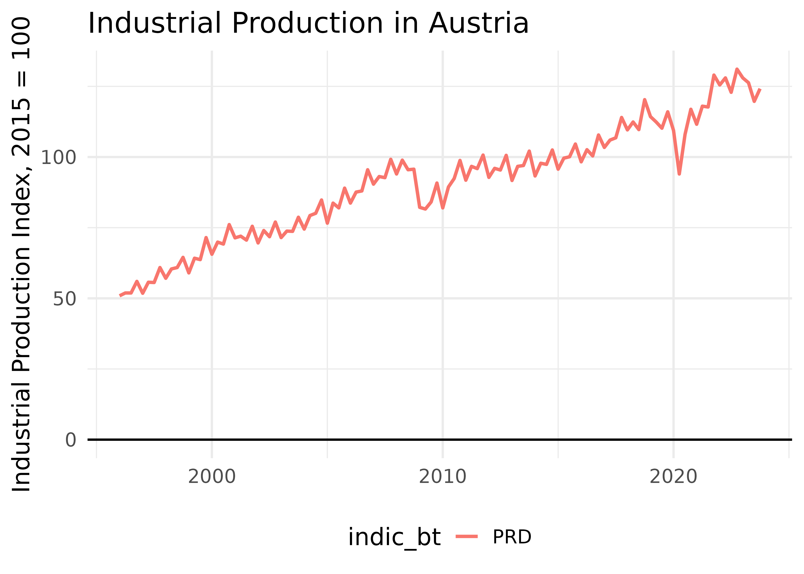
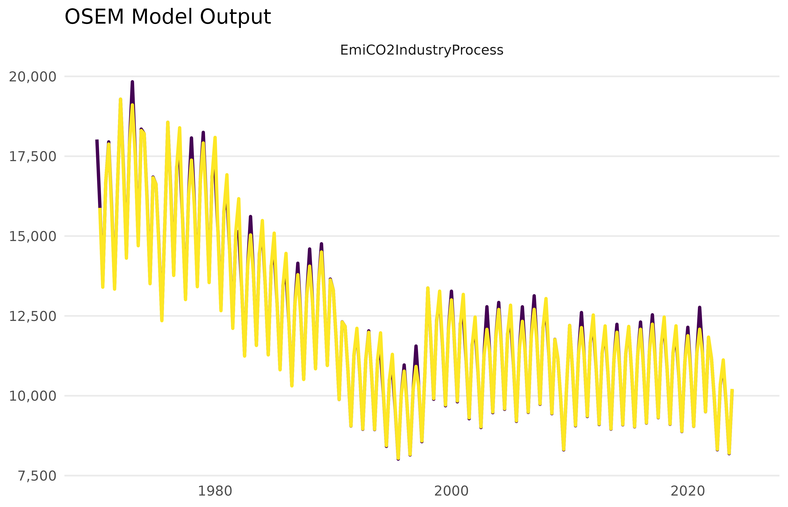
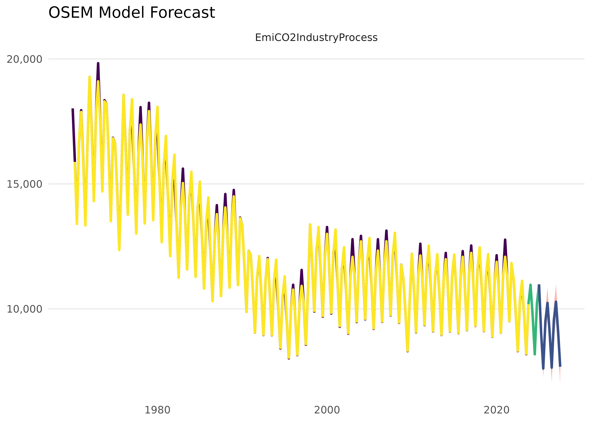

# Adding a new variable to the Dictionary

``` r
library(osem)
library(dplyr)
library(eurostat)
library(ggplot2)
```

This is a vignette to describe the process to add a new variable to the
Dictionary of the package. This is necessary if we want to use a new
variable in the OSEM Model. Here we initially discuss three cases: 1)
the case of adding a **Eurostat** variable and 2) adding a new variable
from the **EDGAR** emission dataset and lastly 3) to simply create a new
identity based on existing variables.

## tl,dr

This is an example how you add a new variable to the Dictionary:

``` r
# Add a new row to 'dict', which is an element of the osem package
dict %>% 
  bind_rows(tibble(
    model_varname = "IndProd", # this is free to choose but must be unique
    full_name = "An index of Industrial Production",
    database  = "eurostat",
    variable_code = "PRD", # in this case use the bt_indicator information here
    dataset_id = "sts_inpr_q",
    var_col = "indic_bt", # here we specify what the column with the variables is called
    freq = "q", # for quarterly data, 'm' would be monthly
    geo = "AT",
    unit = "I15", # for index of 2015 = 100
    s_adj = "NSA", # not seasonally adjusted
    nace_r2 = "B-D")) -> new_dict

# now use the new_dict in run_model
```

## Some general remarks about the Dictionary

The dictionary is the central store of information that is being used
for us to “translate” difficult data codes into useful variable names -
and it is also central for us to tell the OSEM Model what to download.

Let’s take a look at the dictionary:

``` r
dict %>% as_tibble %>% slice(1:10)
#> # A tibble: 10 × 33
#>    model_varname full_name variable_code database dataset_id var_col freq  geo  
#>    <chr>         <chr>     <chr>         <chr>    <chr>      <chr>   <chr> <chr>
#>  1 Supply        Total Su… NA            NA       NA         NA      NA    NA   
#>  2 Demand        Total De… NA            NA       NA         NA      NA    NA   
#>  3 GDPOutput     GDP Outp… NA            NA       NA         NA      NA    NA   
#>  4 GDPExpenditu… GDP Expe… NA            NA       NA         NA      NA    NA   
#>  5 CO2Industry   Co2 Emis… NA            NA       NA         NA      NA    NA   
#>  6 TOTS          Total Su… TOTS          NA       NA         NA      NA    NA   
#>  7 DomDemand     Domestic… DomDemand     NA       NA         NA      NA    NA   
#>  8 ATaxesA       Product … D21           eurostat nama_10_g… na_item a     DE   
#>  9 ASubsidiesA   Product … D31           eurostat nama_10_g… na_item a     DE   
#> 10 CO2Agricultu… CO2 Emis… CO2           eurostat env_ac_ai… airpol  a     DE   
#> # ℹ 25 more variables: unit <chr>, s_adj <chr>, nace_r2 <chr>, cpa2_1 <chr>,
#> #   sector <chr>, direct <chr>, age <chr>, partner <chr>, finpos <chr>,
#> #   p_adj <chr>, meat <chr>, citizen <chr>, wstatus <chr>, tra_oper <chr>,
#> #   ipcc_sector <chr>, GEO <chr>, `Seasonal adjustment` <chr>,
#> #   `North American Industry Classification System (NAICS)` <chr>,
#> #   `North American Product Classification System (NAPCS)` <chr>, Prices <chr>,
#> #   `Type of fuel` <chr>, `Products and product groups` <chr>, …
```

A few words about the variables/columns in the dictionary: There are a
few crucial columns that will nearly always be needed/useful. These are:

- **model_varname:** Variable name in the model equations, must be
  unique.

- **full_name:** Full name/description of the variable.

Currently full in use are also the columns:

- **database:** Name of the database. Internally implemented are
  “eurostat” and “edgar.”

- **variable_code:** Identifier of the variable if applicable, e.g.,
  Eurostat variable code.

- **dataset_id:** Identifier of the dataset where the variable is
  available, e.g., Eurostat dataset code or link to file on the web.

More varied is the use of:

- **var_col:** Name of variable/column in the dataset.

- **freq:** Frequency of the variable in the dataset. “m” for monthly,
  “q” for quarterly.

- **geo:** ISO 3166-1 alpha-2 country code.

- **unit:** Eurostat unit in which the variable is measured, e.g., to
  choose between different measurements for the same variable.

- **s_adj:** Eurostat seasonal adjustment or not.

- **nace_r2:** Eurostat identifier for NACE Rev. 2 classification.

- **ipcc_sector:** EDGAR IPCC National Greenhouse Gas Inventories, see
  [link](https://www.ipcc-nggip.iges.or.jp/public/2006gl/index.html).
  “TOTAL” is not an official IPCC code but is internally interpreted to
  use country totals.

- **cpa2_1:** Eurostat identifier for Classification of Products by
  Activity (CPA).

- **siec:** Standard International Energy Product Classification, e.g.,
  for Eurostat.

## Adding a variable from Eurostat

Firstly, head over to Eurostat to find out more about the variable you
would like to add. There are a few data viewer options in Eurostat, but
we recommend using the “Data Explorer” for this. Here is a good link to
get started:

[Eurostat Data Viewer Data Navigation
Tree](https://ec.europa.eu/eurostat/databrowser/explore/all/all_themes)



### Identifying the correct information needed

Now let’s assume that we want to add some form of **Industrial
Production** to the dataset
[(Link](https://ec.europa.eu/eurostat/databrowser/view/sts_inpr_q/default/table?lang=en)).
So we head back to the data tree and select the quarterly dataset for
Industrial Production (`sts_inpr_q`):



Now let’s take a closer look at the data features that are typically at
the top of the screen:



This already gives us something crucial: the dataset identifier, in this
case `sts_inpr_q`. This corresponds to the column `dataset_id` in the
Dictionary `dict`.

To find out even more about all the detailed features of the dataset, we
click on the big encircled `+` that are e.g. next to “Time” or “Unit of
Measure”. This gives us the ability to play around a bit more and define
a custom dataset for our specific needs:



This really is the window that we will need to focus on quite a bit.
First of all, we note that the different dimensions of the data are
encapsulated in square brackets `[ ]`, like `time`, `indicator_bt`, or
`s_adj`, here the most relevant marked in yellow:



To identify the correct data, we now need to click through the different
dimensions and make note of what it is that we want to use.

While the available types will vary depending on Eurostat data, most
variables relevant for the OSEM Model will include:

- Some variable that indicates the specific variable name, like
  `na_item` or `indic_bt`, depending on the Eurostat guidelines
  associated with the data collection method used.

- `time`

- `geo`: the geography that the data belongs to (see [Glossary:Country
  codes - Statistics Explained
  (europa.eu)](https://ec.europa.eu/eurostat/statistics-explained/index.php?title=Glossary:Country_codes)
  for more information on the format).

- `unit`: the unit of the variable like €, tonnes, %, etc. (frequently
  also some kind of indices like `I15` for `Index = 2015`). This
  corresponds to the unit column in the Dictionary dict.

- `s_adj`: Seasonal Adjustment, e.g. NSA refers to “No Seasonal
  Adjustment”

- Sometimes the data we consider can be broken down even further,
  e.g. according to sectors or physical quantities (like different
  greenhouse gases). These include for example things like:

  - `nace_r2`: A column and indicator that indicates the sector
    according to the Statistical classification of economic activities
    in the European Community (NACE Revision 2)

  - `cp2_1`: A column and indicator that indicates the [Statistical
    classification of products by activity, 2.1 (CPA
    2.1)](https://op.europa.eu/en/web/eu-vocabularies/dataset/-/resource?uri=http://publications.europa.eu/resource/dataset/cpa21)

  - `siec`: Standard International Energy Product Classification

Based on all the information above, let’s say that we want to add a
variable from the dataset `sts_inpr_q`:

- industrial production,

- that spans all NACE rev. 2 sectors in the sectors B to D,

- for Austria,

- using the unit of an index that is set to the 2015 value and

- is not seasonally adjusted.

### Checking the new variable

Given this information, let’s try to download it first - using the
`get_eurostat` function from the {`eurostat}` package:

``` r
dat_raw <- get_eurostat(id = "sts_inpr_q")
```

Now let’s filter this raw dataset down to the data series that we need:

``` r
dat_raw %>% 
  filter(indic_bt == "PRD", # for industrial production variable
         nace_r2 == "B-D", # to select all NACE rev 2 sectors in B, C, and D
         s_adj == "NSA", # to get the raw, non-adjusted data
         unit == "I15", # to get the 2015 Index
         geo == "AT" # to get only the Austrian data
         ) -> dat_AT
dat_AT
```

This looks quite good. We can plot this really quickly:

``` r
ggplot(dat_AT, aes(x = TIME_PERIOD, y = values, color = indic_bt)) + 
  geom_line(linewidth = 1) + 
  
  # add some styling
  geom_hline(aes(yintercept = 0)) + # to get a line through 0
  labs(title = "Industrial Production in Austria", x = NULL, y = "Industrial Production Index, 2015 = 100") + 
  theme_minimal(base_size = 15)+
  theme(legend.position = "bottom")
```



### Adding the variable to the dictionary

Now that we know what the data looks like and have verified that this is
what we want to add, we can add this to the dictionary. For this, we
consider the column names of the dictionary again.

``` r
dict %>% names
#>  [1] "model_varname"                                        
#>  [2] "full_name"                                            
#>  [3] "variable_code"                                        
#>  [4] "database"                                             
#>  [5] "dataset_id"                                           
#>  [6] "var_col"                                              
#>  [7] "freq"                                                 
#>  [8] "geo"                                                  
#>  [9] "unit"                                                 
#> [10] "s_adj"                                                
#> [11] "nace_r2"                                              
#> [12] "cpa2_1"                                               
#> [13] "sector"                                               
#> [14] "direct"                                               
#> [15] "age"                                                  
#> [16] "partner"                                              
#> [17] "finpos"                                               
#> [18] "p_adj"                                                
#> [19] "meat"                                                 
#> [20] "citizen"                                              
#> [21] "wstatus"                                              
#> [22] "tra_oper"                                             
#> [23] "ipcc_sector"                                          
#> [24] "GEO"                                                  
#> [25] "Seasonal adjustment"                                  
#> [26] "North American Industry Classification System (NAICS)"
#> [27] "North American Product Classification System (NAPCS)" 
#> [28] "Prices"                                               
#> [29] "Type of fuel"                                         
#> [30] "Products and product groups"                          
#> [31] "ref_area"                                             
#> [32] "commodity"                                            
#> [33] "unit_measure"
```

And of course checking the documentation of dict again:

``` r
?dict
```

Essentially, we need to add our new variable to our dictionary by simply
adding it as a new row. We can e.g. do this with
[`rbind()`](https://rdrr.io/r/base/cbind.html) or
[`bind_rows()`](https://dplyr.tidyverse.org/reference/bind_rows.html).
Depending on the variable that we consider, we will need to fill out as
many columns as possible. For our example this means:

``` r
dict %>% 
  bind_rows(tibble(
    model_varname = "IndProdIdx", # this is free to choose but must be unique
    full_name = "An index of Industrial Production",
    database  = "eurostat",
    variable_code = "PRD", # in this case use the bt_indicator information here
    dataset_id = "sts_inpr_q",
    var_col = "indic_bt", # here we specify what the column with the variables is called
    freq = "q", # for quarterly data, 'm' would be monthly
    geo = "AT",
    unit = "I15", # for index of 2015 = 100
    s_adj = "NSA", # not seasonally adjusted
    nace_r2 = "B-D")) -> new_dict
```

Now we are done and have successfully created a new dictionary!!

``` r
new_dict %>% 
  as_tibble() %>% 
  tail
#> # A tibble: 6 × 33
#>   model_varname  full_name variable_code database dataset_id var_col freq  geo  
#>   <chr>          <chr>     <chr>         <chr>    <chr>      <chr>   <chr> <chr>
#> 1 CPI_Energy     Consumer… NA            statcan  18-10-000… NA      m     NA   
#> 2 CPI_Gasoline   Consumer… NA            statcan  18-10-000… NA      m     NA   
#> 3 IndProdPriceI… Total, I… NA            statcan  18-10-026… NA      m     NA   
#> 4 IndProdGDP     Industri… NA            statcan  36-10-043… NA      m     NA   
#> 5 WORLD_OIL      World Oi… NA            imf      PCPS       NA      M     NA   
#> 6 IndProdIdx     An index… PRD           eurostat sts_inpr_q indic_… q     AT   
#> # ℹ 25 more variables: unit <chr>, s_adj <chr>, nace_r2 <chr>, cpa2_1 <chr>,
#> #   sector <chr>, direct <chr>, age <chr>, partner <chr>, finpos <chr>,
#> #   p_adj <chr>, meat <chr>, citizen <chr>, wstatus <chr>, tra_oper <chr>,
#> #   ipcc_sector <chr>, GEO <chr>, `Seasonal adjustment` <chr>,
#> #   `North American Industry Classification System (NAICS)` <chr>,
#> #   `North American Product Classification System (NAPCS)` <chr>, Prices <chr>,
#> #   `Type of fuel` <chr>, `Products and product groups` <chr>, …
```

### Quickly run a small model to check if it works:

We can now put this to the test in an extremely small model. We
construct a model of the CO\[2\] Process Emissions in Industry as a
function of Gas and Electricity Prices as well as our new measure for
Industrial Production:

$$EmiCO2IndustryProcess = HICP_{Gas} + HICP_{Electricity} + IndProdIdx$$

This is then the specification that we will run. Here, the type is set
to `n`, which denotes an endogenously modelled (estimated) equation.
This is in contrast to `d`, which is used for definitions or identities
(i.e., equations that are not estimated but are defined by
relationships).

``` r
specification <- dplyr::tibble(
  type = c(
    "n"
  ),
  dependent = c(
    "EmiCO2IndustryProcess"
  ),
  independent = c(
    "HICP_Gas + HICP_Electricity + IndProdIdx"
  )
)
specification
#> # A tibble: 1 × 3
#>   type  dependent             independent                             
#>   <chr> <chr>                 <chr>                                   
#> 1 n     EmiCO2IndustryProcess HICP_Gas + HICP_Electricity + IndProdIdx
```

With that specification set up, we now run the model using the
`new_dict` that we constructed earlier.

``` r
model <- run_model(specification = specification,
                   dictionary = new_dict,

                   present = FALSE,
                   quiet = TRUE,
                   constrain.to.minimum.sample = FALSE)
```



Let’s visualise this model alongside its forecast:

``` r
mod_fcast <- forecast_model(model, plot = FALSE)
#> No exogenous values provided. Model will forecast the exogenous values with an AR4 process (incl. Q dummies, IIS and SIS w 't.pval = 0.001').
#> Alternative is exog_fill_method = 'last'.
plot(mod_fcast)
```


