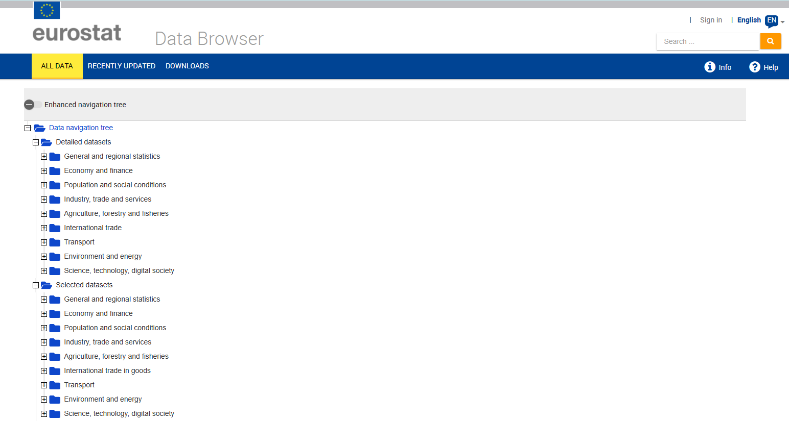
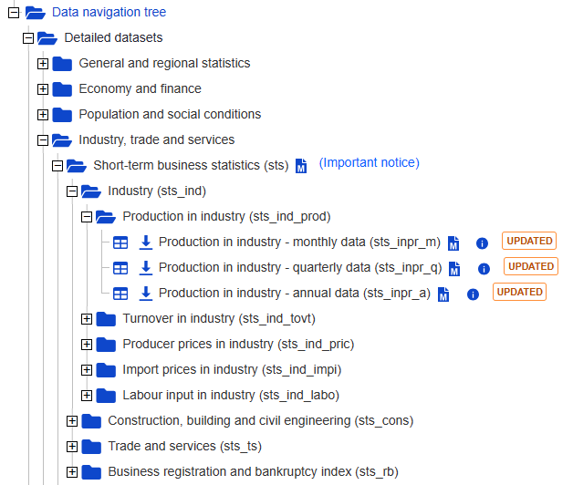
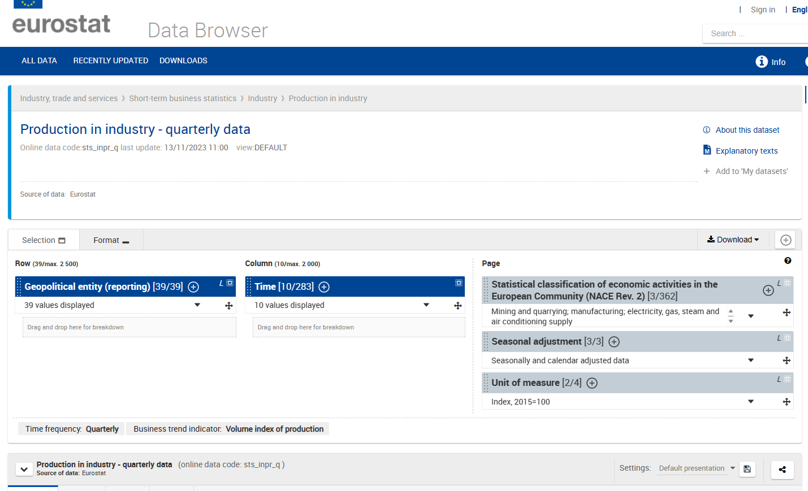
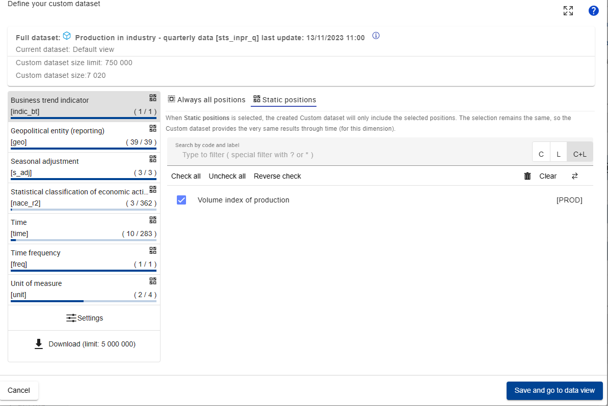
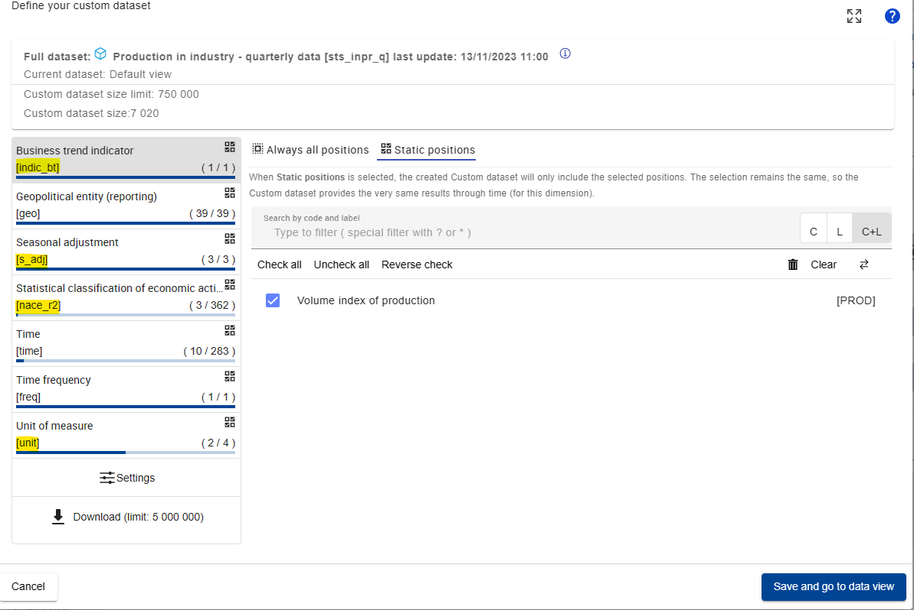

```{r, include = FALSE}
knitr::opts_chunk$set(
  collapse = TRUE,
  comment = "#>",
  fig.width = 7,
  dpi = 300
)
```

```{r setup, message=FALSE}
library(osem)
library(dplyr)
library(eurostat)
library(ggplot2)
```

This is a vignette to describe the process to add a new variable to the Dictionary of the package. This is necessary if we want to use a new variable in the OSEM Model. Here we initially discuss three cases: 1) the case of adding a **Eurostat** variable and 2) adding a new variable from the **EDGAR** emission dataset and lastly 3) to simply create a new identity based on existing variables.

# tl,dr

This is an example how you add a new variable to the Dictionary:

```{r}
# Add a new row to 'dict', which is an element of the osem package
dict %>% 
  bind_rows(tibble(
    model_varname = "IndProd", # this is free to choose but must be unique
    full_name = "An index of Industrial Production",
    database  = "eurostat",
    variable_code = "PRD", # in this case use the bt_indicator information here
    dataset_id = "sts_inpr_q",
    var_col = "indic_bt", # here we specify what the column with the variables is called
    freq = "q", # for quarterly data, 'm' would be monthly
    geo = "AT",
    unit = "I15", # for index of 2015 = 100
    s_adj = "NSA", # not seasonally adjusted
    nace_r2 = "B-D")) -> new_dict

# now use the new_dict in run_model
```

# Some general remarks about the Dictionary

The dictionary is the central store of information that is being used for us to "translate" difficult data codes into useful variable names - and it is also central for us to tell the OSEM Model what to download.

Let's take a look at the dictionary:

```{r}
dict %>% as_tibble %>% slice(1:10)
```

A few words about the variables/columns in the dictionary: There are a few crucial columns that will nearly always be needed/useful. These are:

-   **model_varname:** Variable name in the model equations, must be unique.

-   **full_name:** Full name/description of the variable.

Currently full in use are also the columns:

-   **database:** Name of the database. Internally implemented are "eurostat" and "edgar."

-   **variable_code:** Identifier of the variable if applicable, e.g., Eurostat variable code.

-   **dataset_id:** Identifier of the dataset where the variable is available, e.g., Eurostat dataset code or link to file on the web.

More varied is the use of:

-   **var_col:** Name of variable/column in the dataset.

-   **freq:** Frequency of the variable in the dataset. "m" for monthly, "q" for quarterly.

-   **geo:** ISO 3166-1 alpha-2 country code.

-   **unit:** Eurostat unit in which the variable is measured, e.g., to choose between different measurements for the same variable.

-   **s_adj:** Eurostat seasonal adjustment or not.

-   **nace_r2:** Eurostat identifier for NACE Rev. 2 classification.

-   **ipcc_sector:** EDGAR IPCC National Greenhouse Gas Inventories, see [link](https://www.ipcc-nggip.iges.or.jp/public/2006gl/index.html). "TOTAL" is not an official IPCC code but is internally interpreted to use country totals.

-   **cpa2_1:** Eurostat identifier for Classification of Products by Activity (CPA).

-   **siec:** Standard International Energy Product Classification, e.g., for Eurostat.

# Adding a variable from Eurostat

Firstly, head over to Eurostat to find out more about the variable you would like to add. There are a few data viewer options in Eurostat, but we recommend using the "Data Explorer" for this. Here is a good link to get started:

[Eurostat Data Viewer Data Navigation Tree](https://ec.europa.eu/eurostat/databrowser/explore/all/all_themes)

{width="100%"}

## Identifying the correct information needed

Now let's assume that we want to add some form of **Industrial Production** to the dataset [(Link](https://ec.europa.eu/eurostat/databrowser/view/sts_inpr_q/default/table?lang=en)). So we head back to the data tree and select the quarterly dataset for Industrial Production (`sts_inpr_q`):

{width="100%"}

Now let's take a closer look at the data features that are typically at the top of the screen:

{width="100%"}

This already gives us something crucial: the dataset identifier, in this case `sts_inpr_q`. This corresponds to the column `dataset_id` in the Dictionary `dict`.

To find out even more about all the detailed features of the dataset, we click on the big encircled `+` that are e.g. next to "Time" or "Unit of Measure". This gives us the ability to play around a bit more and define a custom dataset for our specific needs:

{width="100%"}

This really is the window that we will need to focus on quite a bit. First of all, we note that the different dimensions of the data are encapsulated in square brackets `[ ]`, like `time`, `indicator_bt`, or `s_adj`, here the most relevant marked in yellow:

{width="100%"}

To identify the correct data, we now need to click through the different dimensions and make note of what it is that we want to use.

While the available types will vary depending on Eurostat data, most variables relevant for the OSEM Model will include:

-   Some variable that indicates the specific variable name, like `na_item` or `indic_bt`, depending on the Eurostat guidelines associated with the data collection method used.

-   `time`

-   `geo`: the geography that the data belongs to (see [Glossary:Country codes - Statistics Explained (europa.eu)](https://ec.europa.eu/eurostat/statistics-explained/index.php?title=Glossary:Country_codes) for more information on the format).

-   `unit`: the unit of the variable like €, tonnes, %, etc. (frequently also some kind of indices like `I15` for `Index = 2015`). This corresponds to the unit column in the Dictionary dict.

-   `s_adj`: Seasonal Adjustment, e.g. NSA refers to "No Seasonal Adjustment"

-   Sometimes the data we consider can be broken down even further, e.g. according to sectors or physical quantities (like different greenhouse gases). These include for example things like:

    -   `nace_r2`: A column and indicator that indicates the sector according to the Statistical classification of economic activities in the European Community (NACE Revision 2)

    -   `cp2_1`: A column and indicator that indicates the [Statistical classification of products by activity, 2.1 (CPA 2.1)](https://op.europa.eu/en/web/eu-vocabularies/dataset/-/resource?uri=http://publications.europa.eu/resource/dataset/cpa21)

    -   `siec`: Standard International Energy Product Classification

Based on all the information above, let's say that we want to add a variable from the dataset `sts_inpr_q`:

-   industrial production,

-   that spans all NACE rev. 2 sectors in the sectors B to D,

-   for Austria,

-   using the unit of an index that is set to the 2015 value and

-   is not seasonally adjusted.

## Checking the new variable

Given this information, let's try to download it first - using the `get_eurostat` function from the {`eurostat}` package:

```{r,eval=FALSE,message=FALSE, warning=FALSE, results='hide'}
dat_raw <- get_eurostat(id = "sts_inpr_q")
```


Now let's filter this raw dataset down to the data series that we need:

```{r, eval=FALSE}
dat_raw %>% 
  filter(indic_bt == "PRD", # for industrial production variable
         nace_r2 == "B-D", # to select all NACE rev 2 sectors in B, C, and D
         s_adj == "NSA", # to get the raw, non-adjusted data
         unit == "I15", # to get the 2015 Index
         geo == "AT" # to get only the Austrian data
         ) -> dat_AT
dat_AT
```

```{r, include=FALSE}
dat_AT <- structure(list(freq = c("Q", "Q", "Q", "Q", "Q", "Q", "Q", "Q", 
"Q", "Q", "Q", "Q", "Q", "Q", "Q", "Q", "Q", "Q", "Q", "Q", "Q", 
"Q", "Q", "Q", "Q", "Q", "Q", "Q", "Q", "Q", "Q", "Q", "Q", "Q", 
"Q", "Q", "Q", "Q", "Q", "Q", "Q", "Q", "Q", "Q", "Q", "Q", "Q", 
"Q", "Q", "Q", "Q", "Q", "Q", "Q", "Q", "Q", "Q", "Q", "Q", "Q", 
"Q", "Q", "Q", "Q", "Q", "Q", "Q", "Q", "Q", "Q", "Q", "Q", "Q", 
"Q", "Q", "Q", "Q", "Q", "Q", "Q", "Q", "Q", "Q", "Q", "Q", "Q", 
"Q", "Q", "Q", "Q", "Q", "Q", "Q", "Q", "Q", "Q", "Q", "Q", "Q", 
"Q", "Q", "Q", "Q", "Q", "Q", "Q", "Q", "Q", "Q", "Q", "Q", "Q"
), indic_bt = c("PRD", "PRD", "PRD", "PRD", "PRD", "PRD", "PRD", 
"PRD", "PRD", "PRD", "PRD", "PRD", "PRD", "PRD", "PRD", "PRD", 
"PRD", "PRD", "PRD", "PRD", "PRD", "PRD", "PRD", "PRD", "PRD", 
"PRD", "PRD", "PRD", "PRD", "PRD", "PRD", "PRD", "PRD", "PRD", 
"PRD", "PRD", "PRD", "PRD", "PRD", "PRD", "PRD", "PRD", "PRD", 
"PRD", "PRD", "PRD", "PRD", "PRD", "PRD", "PRD", "PRD", "PRD", 
"PRD", "PRD", "PRD", "PRD", "PRD", "PRD", "PRD", "PRD", "PRD", 
"PRD", "PRD", "PRD", "PRD", "PRD", "PRD", "PRD", "PRD", "PRD", 
"PRD", "PRD", "PRD", "PRD", "PRD", "PRD", "PRD", "PRD", "PRD", 
"PRD", "PRD", "PRD", "PRD", "PRD", "PRD", "PRD", "PRD", "PRD", 
"PRD", "PRD", "PRD", "PRD", "PRD", "PRD", "PRD", "PRD", "PRD", 
"PRD", "PRD", "PRD", "PRD", "PRD", "PRD", "PRD", "PRD", "PRD", 
"PRD", "PRD", "PRD", "PRD", "PRD", "PRD"), nace_r2 = c("B-D", 
"B-D", "B-D", "B-D", "B-D", "B-D", "B-D", "B-D", "B-D", "B-D", 
"B-D", "B-D", "B-D", "B-D", "B-D", "B-D", "B-D", "B-D", "B-D", 
"B-D", "B-D", "B-D", "B-D", "B-D", "B-D", "B-D", "B-D", "B-D", 
"B-D", "B-D", "B-D", "B-D", "B-D", "B-D", "B-D", "B-D", "B-D", 
"B-D", "B-D", "B-D", "B-D", "B-D", "B-D", "B-D", "B-D", "B-D", 
"B-D", "B-D", "B-D", "B-D", "B-D", "B-D", "B-D", "B-D", "B-D", 
"B-D", "B-D", "B-D", "B-D", "B-D", "B-D", "B-D", "B-D", "B-D", 
"B-D", "B-D", "B-D", "B-D", "B-D", "B-D", "B-D", "B-D", "B-D", 
"B-D", "B-D", "B-D", "B-D", "B-D", "B-D", "B-D", "B-D", "B-D", 
"B-D", "B-D", "B-D", "B-D", "B-D", "B-D", "B-D", "B-D", "B-D", 
"B-D", "B-D", "B-D", "B-D", "B-D", "B-D", "B-D", "B-D", "B-D", 
"B-D", "B-D", "B-D", "B-D", "B-D", "B-D", "B-D", "B-D", "B-D", 
"B-D", "B-D", "B-D"), s_adj = c("NSA", "NSA", "NSA", "NSA", "NSA", 
"NSA", "NSA", "NSA", "NSA", "NSA", "NSA", "NSA", "NSA", "NSA", 
"NSA", "NSA", "NSA", "NSA", "NSA", "NSA", "NSA", "NSA", "NSA", 
"NSA", "NSA", "NSA", "NSA", "NSA", "NSA", "NSA", "NSA", "NSA", 
"NSA", "NSA", "NSA", "NSA", "NSA", "NSA", "NSA", "NSA", "NSA", 
"NSA", "NSA", "NSA", "NSA", "NSA", "NSA", "NSA", "NSA", "NSA", 
"NSA", "NSA", "NSA", "NSA", "NSA", "NSA", "NSA", "NSA", "NSA", 
"NSA", "NSA", "NSA", "NSA", "NSA", "NSA", "NSA", "NSA", "NSA", 
"NSA", "NSA", "NSA", "NSA", "NSA", "NSA", "NSA", "NSA", "NSA", 
"NSA", "NSA", "NSA", "NSA", "NSA", "NSA", "NSA", "NSA", "NSA", 
"NSA", "NSA", "NSA", "NSA", "NSA", "NSA", "NSA", "NSA", "NSA", 
"NSA", "NSA", "NSA", "NSA", "NSA", "NSA", "NSA", "NSA", "NSA", 
"NSA", "NSA", "NSA", "NSA", "NSA", "NSA", "NSA", "NSA"), unit = c("I15", 
"I15", "I15", "I15", "I15", "I15", "I15", "I15", "I15", "I15", 
"I15", "I15", "I15", "I15", "I15", "I15", "I15", "I15", "I15", 
"I15", "I15", "I15", "I15", "I15", "I15", "I15", "I15", "I15", 
"I15", "I15", "I15", "I15", "I15", "I15", "I15", "I15", "I15", 
"I15", "I15", "I15", "I15", "I15", "I15", "I15", "I15", "I15", 
"I15", "I15", "I15", "I15", "I15", "I15", "I15", "I15", "I15", 
"I15", "I15", "I15", "I15", "I15", "I15", "I15", "I15", "I15", 
"I15", "I15", "I15", "I15", "I15", "I15", "I15", "I15", "I15", 
"I15", "I15", "I15", "I15", "I15", "I15", "I15", "I15", "I15", 
"I15", "I15", "I15", "I15", "I15", "I15", "I15", "I15", "I15", 
"I15", "I15", "I15", "I15", "I15", "I15", "I15", "I15", "I15", 
"I15", "I15", "I15", "I15", "I15", "I15", "I15", "I15", "I15", 
"I15", "I15", "I15"), geo = c("AT", "AT", "AT", "AT", "AT", "AT", 
"AT", "AT", "AT", "AT", "AT", "AT", "AT", "AT", "AT", "AT", "AT", 
"AT", "AT", "AT", "AT", "AT", "AT", "AT", "AT", "AT", "AT", "AT", 
"AT", "AT", "AT", "AT", "AT", "AT", "AT", "AT", "AT", "AT", "AT", 
"AT", "AT", "AT", "AT", "AT", "AT", "AT", "AT", "AT", "AT", "AT", 
"AT", "AT", "AT", "AT", "AT", "AT", "AT", "AT", "AT", "AT", "AT", 
"AT", "AT", "AT", "AT", "AT", "AT", "AT", "AT", "AT", "AT", "AT", 
"AT", "AT", "AT", "AT", "AT", "AT", "AT", "AT", "AT", "AT", "AT", 
"AT", "AT", "AT", "AT", "AT", "AT", "AT", "AT", "AT", "AT", "AT", 
"AT", "AT", "AT", "AT", "AT", "AT", "AT", "AT", "AT", "AT", "AT", 
"AT", "AT", "AT", "AT", "AT", "AT", "AT"), TIME_PERIOD = structure(c(9496, 
9587, 9678, 9770, 9862, 9952, 10043, 10135, 10227, 10317, 10408, 
10500, 10592, 10682, 10773, 10865, 10957, 11048, 11139, 11231, 
11323, 11413, 11504, 11596, 11688, 11778, 11869, 11961, 12053, 
12143, 12234, 12326, 12418, 12509, 12600, 12692, 12784, 12874, 
12965, 13057, 13149, 13239, 13330, 13422, 13514, 13604, 13695, 
13787, 13879, 13970, 14061, 14153, 14245, 14335, 14426, 14518, 
14610, 14700, 14791, 14883, 14975, 15065, 15156, 15248, 15340, 
15431, 15522, 15614, 15706, 15796, 15887, 15979, 16071, 16161, 
16252, 16344, 16436, 16526, 16617, 16709, 16801, 16892, 16983, 
17075, 17167, 17257, 17348, 17440, 17532, 17622, 17713, 17805, 
17897, 17987, 18078, 18170, 18262, 18353, 18444, 18536, 18628, 
18718, 18809, 18901, 18993, 19083, 19174, 19266, 19358, 19448, 
19539, 19631), class = "Date"), values = c(50.9, 51.9, 51.9, 
56, 51.8, 55.7, 55.6, 60.9, 57.1, 60.4, 60.9, 64.5, 59, 64.2, 
63.7, 71.5, 65.6, 69.9, 69.2, 76.1, 71.4, 72, 70.6, 75.5, 69.6, 
74, 71.8, 77, 71.5, 73.8, 73.7, 78.7, 74.5, 79.3, 80.1, 84.8, 
76.6, 83.7, 82, 89, 83.7, 87.6, 88, 95.5, 90.4, 93.1, 92.7, 99.2, 
94, 98.9, 95.5, 95.7, 82.2, 81.6, 84.1, 90.8, 82, 89.4, 92.4, 
98.8, 91.8, 96.7, 95.9, 100.7, 92.8, 96, 95.4, 100.6, 91.7, 96.7, 
97, 102.1, 93.3, 97.8, 97.4, 102.5, 95.7, 99.6, 100.1, 104.6, 
98.3, 102.6, 100.4, 107.8, 103.4, 106, 106.8, 114, 109.6, 112.4, 
109.7, 120.3, 114.3, 112.4, 110.2, 116, 109.4, 94, 108, 116.9, 
111.6, 118, 117.7, 129, 125.5, 128, 122.9, 131.1, 128, 126.3, 
119.7, 124.2)), row.names = c(NA, -112L), class = c("tbl_df", 
"tbl", "data.frame"))
```


This looks quite good. We can plot this really quickly:

```{r, fig.height=5, out.width="100%"}
ggplot(dat_AT, aes(x = TIME_PERIOD, y = values, color = indic_bt)) + 
  geom_line(linewidth = 1) + 
  
  # add some styling
  geom_hline(aes(yintercept = 0)) + # to get a line through 0
  labs(title = "Industrial Production in Austria", x = NULL, y = "Industrial Production Index, 2015 = 100") + 
  theme_minimal(base_size = 15)+
  theme(legend.position = "bottom")
```

## Adding the variable to the dictionary

Now that we know what the data looks like and have verified that this is what we want to add, we can add this to the dictionary. For this, we consider the column names of the dictionary again.

```{r}
dict %>% names
```

And of course checking the documentation of dict again:

```{r,eval = FALSE}
?dict
```

Essentially, we need to add our new variable to our dictionary by simply adding it as a new row. We can e.g. do this with `rbind()` or `bind_rows()`. Depending on the variable that we consider, we will need to fill out as many columns as possible. For our example this means:

```{r}
dict %>% 
  bind_rows(tibble(
    model_varname = "IndProdIdx", # this is free to choose but must be unique
    full_name = "An index of Industrial Production",
    database  = "eurostat",
    variable_code = "PRD", # in this case use the bt_indicator information here
    dataset_id = "sts_inpr_q",
    var_col = "indic_bt", # here we specify what the column with the variables is called
    freq = "q", # for quarterly data, 'm' would be monthly
    geo = "AT",
    unit = "I15", # for index of 2015 = 100
    s_adj = "NSA", # not seasonally adjusted
    nace_r2 = "B-D")) -> new_dict
```

Now we are done and have successfully created a new dictionary!!

```{r}
new_dict %>% 
  as_tibble() %>% 
  tail
```

## Quickly run a small model to check if it works:

We can now put this to the test in an extremely small model. We construct a model of the CO[2] Process Emissions in Industry as a function of Gas and Electricity Prices as well as our new measure for Industrial Production:

$$
EmiCO2IndustryProcess = HICP_{Gas} + HICP_{Electricity} + IndProdIdx
$$

This is then the specification that we will run. Here, the type is set to `n`, which denotes an endogenously modelled (estimated) equation. This is in contrast to `d`, which is used for definitions or identities (i.e., equations that are not estimated but are defined by relationships). 

```{r}
specification <- dplyr::tibble(
  type = c(
    "n"
  ),
  dependent = c(
    "EmiCO2IndustryProcess"
  ),
  independent = c(
    "HICP_Gas + HICP_Electricity + IndProdIdx"
  )
)
specification
```

With that specification set up, we now run the model using the `new_dict` that we constructed earlier.

```{r, include=FALSE}
model_dat <- structure(list(time = structure(c(9496, 9587, 9678, 9770, 9862, 
9952, 10043, 10135, 10227, 10317, 10408, 10500, 10592, 10682, 
10773, 10865, 10957, 11048, 11139, 11231, 11323, 11413, 11504, 
11596, 11688, 11778, 11869, 11961, 12053, 12143, 12234, 12326, 
12418, 12509, 12600, 12692, 12784, 12874, 12965, 13057, 13149, 
13239, 13330, 13422, 13514, 13604, 13695, 13787, 13879, 13970, 
14061, 14153, 14245, 14335, 14426, 14518, 14610, 14700, 14791, 
14883, 14975, 15065, 15156, 15248, 15340, 15431, 15522, 15614, 
15706, 15796, 15887, 15979, 16071, 16161, 16252, 16344, 16436, 
16526, 16617, 16709, 16801, 16892, 16983, 17075, 17167, 17257, 
17348, 17440, 17532, 17622, 17713, 17805, 17897, 17987, 18078, 
18170, 18262, 18353, 18444, 18536, 18628, 18718, 18809, 18901, 
18993, 19083, 19174, 19266, 19358, 19448, 19539, 19631, 19723, 
19814, 19905, 19997, 20089, 9496, 9587, 9678, 9770, 9862, 9952, 
10043, 10135, 10227, 10317, 10408, 10500, 10592, 10682, 10773, 
10865, 10957, 11048, 11139, 11231, 11323, 11413, 11504, 11596, 
11688, 11778, 11869, 11961, 12053, 12143, 12234, 12326, 12418, 
12509, 12600, 12692, 12784, 12874, 12965, 13057, 13149, 13239, 
13330, 13422, 13514, 13604, 13695, 13787, 13879, 13970, 14061, 
14153, 14245, 14335, 14426, 14518, 14610, 14700, 14791, 14883, 
14975, 15065, 15156, 15248, 15340, 15431, 15522, 15614, 15706, 
15796, 15887, 15979, 16071, 16161, 16252, 16344, 16436, 16526, 
16617, 16709, 16801, 16892, 16983, 17075, 17167, 17257, 17348, 
17440, 17532, 17622, 17713, 17805, 17897, 17987, 18078, 18170, 
18262, 18353, 18444, 18536, 18628, 18718, 18809, 18901, 18993, 
19083, 19174, 19266, 19358, 19448, 19539, 19631, 19723, 19814, 
19905, 19997, 20089, 9496, 9587, 9678, 9770, 9862, 9952, 10043, 
10135, 10227, 10317, 10408, 10500, 10592, 10682, 10773, 10865, 
10957, 11048, 11139, 11231, 11323, 11413, 11504, 11596, 11688, 
11778, 11869, 11961, 12053, 12143, 12234, 12326, 12418, 12509, 
12600, 12692, 12784, 12874, 12965, 13057, 13149, 13239, 13330, 
13422, 13514, 13604, 13695, 13787, 13879, 13970, 14061, 14153, 
14245, 14335, 14426, 14518, 14610, 14700, 14791, 14883, 14975, 
15065, 15156, 15248, 15340, 15431, 15522, 15614, 15706, 15796, 
15887, 15979, 16071, 16161, 16252, 16344, 16436, 16526, 16617, 
16709, 16801, 16892, 16983, 17075, 17167, 17257, 17348, 17440, 
17532, 17622, 17713, 17805, 17897, 17987, 18078, 18170, 18262, 
18353, 18444, 18536, 18628, 18718, 18809, 18901, 18993, 19083, 
19174, 19266, 19358, 19448, 19539, 19631, 0, 90, 181, 273, 365, 
455, 546, 638, 730, 821, 912, 1004, 1096, 1186, 1277, 1369, 1461, 
1551, 1642, 1734, 1826, 1916, 2007, 2099, 2191, 2282, 2373, 2465, 
2557, 2647, 2738, 2830, 2922, 3012, 3103, 3195, 3287, 3377, 3468, 
3560, 3652, 3743, 3834, 3926, 4018, 4108, 4199, 4291, 4383, 4473, 
4564, 4656, 4748, 4838, 4929, 5021, 5113, 5204, 5295, 5387, 5479, 
5569, 5660, 5752, 5844, 5934, 6025, 6117, 6209, 6299, 6390, 6482, 
6574, 6665, 6756, 6848, 6940, 7030, 7121, 7213, 7305, 7395, 7486, 
7578, 7670, 7760, 7851, 7943, 8035, 8126, 8217, 8309, 8401, 8491, 
8582, 8674, 8766, 8856, 8947, 9039, 9131, 9221, 9312, 9404, 9496, 
9587, 9678, 9770, 9862, 9952, 10043, 10135, 10227, 10317, 10408, 
10500, 10592, 10682, 10773, 10865, 10957, 11048, 11139, 11231, 
11323, 11413, 11504, 11596, 11688, 11778, 11869, 11961, 12053, 
12143, 12234, 12326, 12418, 12509, 12600, 12692, 12784, 12874, 
12965, 13057, 13149, 13239, 13330, 13422, 13514, 13604, 13695, 
13787, 13879, 13970, 14061, 14153, 14245, 14335, 14426, 14518, 
14610, 14700, 14791, 14883, 14975, 15065, 15156, 15248, 15340, 
15431, 15522, 15614, 15706, 15796, 15887, 15979, 16071, 16161, 
16252, 16344, 16436, 16526, 16617, 16709, 16801, 16892, 16983, 
17075, 17167, 17257, 17348, 17440, 17532, 17622, 17713, 17805, 
17897, 17987, 18078, 18170, 18262, 18353, 18444, 18536, 18628, 
18718, 18809, 18901, 18993, 19083, 19174, 19266, 19358, 19448, 
19539, 19631), class = "Date"), na_item = c("HICP_Electricity", 
"HICP_Electricity", "HICP_Electricity", "HICP_Electricity", "HICP_Electricity", 
"HICP_Electricity", "HICP_Electricity", "HICP_Electricity", "HICP_Electricity", 
"HICP_Electricity", "HICP_Electricity", "HICP_Electricity", "HICP_Electricity", 
"HICP_Electricity", "HICP_Electricity", "HICP_Electricity", "HICP_Electricity", 
"HICP_Electricity", "HICP_Electricity", "HICP_Electricity", "HICP_Electricity", 
"HICP_Electricity", "HICP_Electricity", "HICP_Electricity", "HICP_Electricity", 
"HICP_Electricity", "HICP_Electricity", "HICP_Electricity", "HICP_Electricity", 
"HICP_Electricity", "HICP_Electricity", "HICP_Electricity", "HICP_Electricity", 
"HICP_Electricity", "HICP_Electricity", "HICP_Electricity", "HICP_Electricity", 
"HICP_Electricity", "HICP_Electricity", "HICP_Electricity", "HICP_Electricity", 
"HICP_Electricity", "HICP_Electricity", "HICP_Electricity", "HICP_Electricity", 
"HICP_Electricity", "HICP_Electricity", "HICP_Electricity", "HICP_Electricity", 
"HICP_Electricity", "HICP_Electricity", "HICP_Electricity", "HICP_Electricity", 
"HICP_Electricity", "HICP_Electricity", "HICP_Electricity", "HICP_Electricity", 
"HICP_Electricity", "HICP_Electricity", "HICP_Electricity", "HICP_Electricity", 
"HICP_Electricity", "HICP_Electricity", "HICP_Electricity", "HICP_Electricity", 
"HICP_Electricity", "HICP_Electricity", "HICP_Electricity", "HICP_Electricity", 
"HICP_Electricity", "HICP_Electricity", "HICP_Electricity", "HICP_Electricity", 
"HICP_Electricity", "HICP_Electricity", "HICP_Electricity", "HICP_Electricity", 
"HICP_Electricity", "HICP_Electricity", "HICP_Electricity", "HICP_Electricity", 
"HICP_Electricity", "HICP_Electricity", "HICP_Electricity", "HICP_Electricity", 
"HICP_Electricity", "HICP_Electricity", "HICP_Electricity", "HICP_Electricity", 
"HICP_Electricity", "HICP_Electricity", "HICP_Electricity", "HICP_Electricity", 
"HICP_Electricity", "HICP_Electricity", "HICP_Electricity", "HICP_Electricity", 
"HICP_Electricity", "HICP_Electricity", "HICP_Electricity", "HICP_Electricity", 
"HICP_Electricity", "HICP_Electricity", "HICP_Electricity", "HICP_Electricity", 
"HICP_Electricity", "HICP_Electricity", "HICP_Electricity", "HICP_Electricity", 
"HICP_Electricity", "HICP_Electricity", "HICP_Electricity", "HICP_Electricity", 
"HICP_Electricity", "HICP_Electricity", "HICP_Electricity", "HICP_Electricity", 
"HICP_Gas", "HICP_Gas", "HICP_Gas", "HICP_Gas", "HICP_Gas", "HICP_Gas", 
"HICP_Gas", "HICP_Gas", "HICP_Gas", "HICP_Gas", "HICP_Gas", "HICP_Gas", 
"HICP_Gas", "HICP_Gas", "HICP_Gas", "HICP_Gas", "HICP_Gas", "HICP_Gas", 
"HICP_Gas", "HICP_Gas", "HICP_Gas", "HICP_Gas", "HICP_Gas", "HICP_Gas", 
"HICP_Gas", "HICP_Gas", "HICP_Gas", "HICP_Gas", "HICP_Gas", "HICP_Gas", 
"HICP_Gas", "HICP_Gas", "HICP_Gas", "HICP_Gas", "HICP_Gas", "HICP_Gas", 
"HICP_Gas", "HICP_Gas", "HICP_Gas", "HICP_Gas", "HICP_Gas", "HICP_Gas", 
"HICP_Gas", "HICP_Gas", "HICP_Gas", "HICP_Gas", "HICP_Gas", "HICP_Gas", 
"HICP_Gas", "HICP_Gas", "HICP_Gas", "HICP_Gas", "HICP_Gas", "HICP_Gas", 
"HICP_Gas", "HICP_Gas", "HICP_Gas", "HICP_Gas", "HICP_Gas", "HICP_Gas", 
"HICP_Gas", "HICP_Gas", "HICP_Gas", "HICP_Gas", "HICP_Gas", "HICP_Gas", 
"HICP_Gas", "HICP_Gas", "HICP_Gas", "HICP_Gas", "HICP_Gas", "HICP_Gas", 
"HICP_Gas", "HICP_Gas", "HICP_Gas", "HICP_Gas", "HICP_Gas", "HICP_Gas", 
"HICP_Gas", "HICP_Gas", "HICP_Gas", "HICP_Gas", "HICP_Gas", "HICP_Gas", 
"HICP_Gas", "HICP_Gas", "HICP_Gas", "HICP_Gas", "HICP_Gas", "HICP_Gas", 
"HICP_Gas", "HICP_Gas", "HICP_Gas", "HICP_Gas", "HICP_Gas", "HICP_Gas", 
"HICP_Gas", "HICP_Gas", "HICP_Gas", "HICP_Gas", "HICP_Gas", "HICP_Gas", 
"HICP_Gas", "HICP_Gas", "HICP_Gas", "HICP_Gas", "HICP_Gas", "HICP_Gas", 
"HICP_Gas", "HICP_Gas", "HICP_Gas", "HICP_Gas", "HICP_Gas", "HICP_Gas", 
"HICP_Gas", "HICP_Gas", "HICP_Gas", "IndProdIdx", "IndProdIdx", 
"IndProdIdx", "IndProdIdx", "IndProdIdx", "IndProdIdx", "IndProdIdx", 
"IndProdIdx", "IndProdIdx", "IndProdIdx", "IndProdIdx", "IndProdIdx", 
"IndProdIdx", "IndProdIdx", "IndProdIdx", "IndProdIdx", "IndProdIdx", 
"IndProdIdx", "IndProdIdx", "IndProdIdx", "IndProdIdx", "IndProdIdx", 
"IndProdIdx", "IndProdIdx", "IndProdIdx", "IndProdIdx", "IndProdIdx", 
"IndProdIdx", "IndProdIdx", "IndProdIdx", "IndProdIdx", "IndProdIdx", 
"IndProdIdx", "IndProdIdx", "IndProdIdx", "IndProdIdx", "IndProdIdx", 
"IndProdIdx", "IndProdIdx", "IndProdIdx", "IndProdIdx", "IndProdIdx", 
"IndProdIdx", "IndProdIdx", "IndProdIdx", "IndProdIdx", "IndProdIdx", 
"IndProdIdx", "IndProdIdx", "IndProdIdx", "IndProdIdx", "IndProdIdx", 
"IndProdIdx", "IndProdIdx", "IndProdIdx", "IndProdIdx", "IndProdIdx", 
"IndProdIdx", "IndProdIdx", "IndProdIdx", "IndProdIdx", "IndProdIdx", 
"IndProdIdx", "IndProdIdx", "IndProdIdx", "IndProdIdx", "IndProdIdx", 
"IndProdIdx", "IndProdIdx", "IndProdIdx", "IndProdIdx", "IndProdIdx", 
"IndProdIdx", "IndProdIdx", "IndProdIdx", "IndProdIdx", "IndProdIdx", 
"IndProdIdx", "IndProdIdx", "IndProdIdx", "IndProdIdx", "IndProdIdx", 
"IndProdIdx", "IndProdIdx", "IndProdIdx", "IndProdIdx", "IndProdIdx", 
"IndProdIdx", "IndProdIdx", "IndProdIdx", "IndProdIdx", "IndProdIdx", 
"IndProdIdx", "IndProdIdx", "IndProdIdx", "IndProdIdx", "IndProdIdx", 
"IndProdIdx", "IndProdIdx", "IndProdIdx", "IndProdIdx", "IndProdIdx", 
"IndProdIdx", "IndProdIdx", "IndProdIdx", "IndProdIdx", "IndProdIdx", 
"IndProdIdx", "IndProdIdx", "IndProdIdx", "IndProdIdx", "IndProdIdx", 
"EmiCO2IndustryProcess", "EmiCO2IndustryProcess", "EmiCO2IndustryProcess", 
"EmiCO2IndustryProcess", "EmiCO2IndustryProcess", "EmiCO2IndustryProcess", 
"EmiCO2IndustryProcess", "EmiCO2IndustryProcess", "EmiCO2IndustryProcess", 
"EmiCO2IndustryProcess", "EmiCO2IndustryProcess", "EmiCO2IndustryProcess", 
"EmiCO2IndustryProcess", "EmiCO2IndustryProcess", "EmiCO2IndustryProcess", 
"EmiCO2IndustryProcess", "EmiCO2IndustryProcess", "EmiCO2IndustryProcess", 
"EmiCO2IndustryProcess", "EmiCO2IndustryProcess", "EmiCO2IndustryProcess", 
"EmiCO2IndustryProcess", "EmiCO2IndustryProcess", "EmiCO2IndustryProcess", 
"EmiCO2IndustryProcess", "EmiCO2IndustryProcess", "EmiCO2IndustryProcess", 
"EmiCO2IndustryProcess", "EmiCO2IndustryProcess", "EmiCO2IndustryProcess", 
"EmiCO2IndustryProcess", "EmiCO2IndustryProcess", "EmiCO2IndustryProcess", 
"EmiCO2IndustryProcess", "EmiCO2IndustryProcess", "EmiCO2IndustryProcess", 
"EmiCO2IndustryProcess", "EmiCO2IndustryProcess", "EmiCO2IndustryProcess", 
"EmiCO2IndustryProcess", "EmiCO2IndustryProcess", "EmiCO2IndustryProcess", 
"EmiCO2IndustryProcess", "EmiCO2IndustryProcess", "EmiCO2IndustryProcess", 
"EmiCO2IndustryProcess", "EmiCO2IndustryProcess", "EmiCO2IndustryProcess", 
"EmiCO2IndustryProcess", "EmiCO2IndustryProcess", "EmiCO2IndustryProcess", 
"EmiCO2IndustryProcess", "EmiCO2IndustryProcess", "EmiCO2IndustryProcess", 
"EmiCO2IndustryProcess", "EmiCO2IndustryProcess", "EmiCO2IndustryProcess", 
"EmiCO2IndustryProcess", "EmiCO2IndustryProcess", "EmiCO2IndustryProcess", 
"EmiCO2IndustryProcess", "EmiCO2IndustryProcess", "EmiCO2IndustryProcess", 
"EmiCO2IndustryProcess", "EmiCO2IndustryProcess", "EmiCO2IndustryProcess", 
"EmiCO2IndustryProcess", "EmiCO2IndustryProcess", "EmiCO2IndustryProcess", 
"EmiCO2IndustryProcess", "EmiCO2IndustryProcess", "EmiCO2IndustryProcess", 
"EmiCO2IndustryProcess", "EmiCO2IndustryProcess", "EmiCO2IndustryProcess", 
"EmiCO2IndustryProcess", "EmiCO2IndustryProcess", "EmiCO2IndustryProcess", 
"EmiCO2IndustryProcess", "EmiCO2IndustryProcess", "EmiCO2IndustryProcess", 
"EmiCO2IndustryProcess", "EmiCO2IndustryProcess", "EmiCO2IndustryProcess", 
"EmiCO2IndustryProcess", "EmiCO2IndustryProcess", "EmiCO2IndustryProcess", 
"EmiCO2IndustryProcess", "EmiCO2IndustryProcess", "EmiCO2IndustryProcess", 
"EmiCO2IndustryProcess", "EmiCO2IndustryProcess", "EmiCO2IndustryProcess", 
"EmiCO2IndustryProcess", "EmiCO2IndustryProcess", "EmiCO2IndustryProcess", 
"EmiCO2IndustryProcess", "EmiCO2IndustryProcess", "EmiCO2IndustryProcess", 
"EmiCO2IndustryProcess", "EmiCO2IndustryProcess", "EmiCO2IndustryProcess", 
"EmiCO2IndustryProcess", "EmiCO2IndustryProcess", "EmiCO2IndustryProcess", 
"EmiCO2IndustryProcess", "EmiCO2IndustryProcess", "EmiCO2IndustryProcess", 
"EmiCO2IndustryProcess", "EmiCO2IndustryProcess", "EmiCO2IndustryProcess", 
"EmiCO2IndustryProcess", "EmiCO2IndustryProcess", "EmiCO2IndustryProcess", 
"EmiCO2IndustryProcess", "EmiCO2IndustryProcess", "EmiCO2IndustryProcess", 
"EmiCO2IndustryProcess", "EmiCO2IndustryProcess", "EmiCO2IndustryProcess", 
"EmiCO2IndustryProcess", "EmiCO2IndustryProcess", "EmiCO2IndustryProcess", 
"EmiCO2IndustryProcess", "EmiCO2IndustryProcess", "EmiCO2IndustryProcess", 
"EmiCO2IndustryProcess", "EmiCO2IndustryProcess", "EmiCO2IndustryProcess", 
"EmiCO2IndustryProcess", "EmiCO2IndustryProcess", "EmiCO2IndustryProcess", 
"EmiCO2IndustryProcess", "EmiCO2IndustryProcess", "EmiCO2IndustryProcess", 
"EmiCO2IndustryProcess", "EmiCO2IndustryProcess", "EmiCO2IndustryProcess", 
"EmiCO2IndustryProcess", "EmiCO2IndustryProcess", "EmiCO2IndustryProcess", 
"EmiCO2IndustryProcess", "EmiCO2IndustryProcess", "EmiCO2IndustryProcess", 
"EmiCO2IndustryProcess", "EmiCO2IndustryProcess", "EmiCO2IndustryProcess", 
"EmiCO2IndustryProcess", "EmiCO2IndustryProcess", "EmiCO2IndustryProcess", 
"EmiCO2IndustryProcess", "EmiCO2IndustryProcess", "EmiCO2IndustryProcess", 
"EmiCO2IndustryProcess", "EmiCO2IndustryProcess", "EmiCO2IndustryProcess", 
"EmiCO2IndustryProcess", "EmiCO2IndustryProcess", "EmiCO2IndustryProcess", 
"EmiCO2IndustryProcess", "EmiCO2IndustryProcess", "EmiCO2IndustryProcess", 
"EmiCO2IndustryProcess", "EmiCO2IndustryProcess", "EmiCO2IndustryProcess", 
"EmiCO2IndustryProcess", "EmiCO2IndustryProcess", "EmiCO2IndustryProcess", 
"EmiCO2IndustryProcess", "EmiCO2IndustryProcess", "EmiCO2IndustryProcess", 
"EmiCO2IndustryProcess", "EmiCO2IndustryProcess", "EmiCO2IndustryProcess", 
"EmiCO2IndustryProcess", "EmiCO2IndustryProcess", "EmiCO2IndustryProcess", 
"EmiCO2IndustryProcess", "EmiCO2IndustryProcess", "EmiCO2IndustryProcess", 
"EmiCO2IndustryProcess", "EmiCO2IndustryProcess", "EmiCO2IndustryProcess", 
"EmiCO2IndustryProcess", "EmiCO2IndustryProcess", "EmiCO2IndustryProcess", 
"EmiCO2IndustryProcess", "EmiCO2IndustryProcess", "EmiCO2IndustryProcess", 
"EmiCO2IndustryProcess", "EmiCO2IndustryProcess", "EmiCO2IndustryProcess", 
"EmiCO2IndustryProcess", "EmiCO2IndustryProcess", "EmiCO2IndustryProcess", 
"EmiCO2IndustryProcess", "EmiCO2IndustryProcess", "EmiCO2IndustryProcess", 
"EmiCO2IndustryProcess", "EmiCO2IndustryProcess", "EmiCO2IndustryProcess", 
"EmiCO2IndustryProcess", "EmiCO2IndustryProcess", "EmiCO2IndustryProcess", 
"EmiCO2IndustryProcess", "EmiCO2IndustryProcess", "EmiCO2IndustryProcess", 
"EmiCO2IndustryProcess", "EmiCO2IndustryProcess", "EmiCO2IndustryProcess", 
"EmiCO2IndustryProcess", "EmiCO2IndustryProcess", "EmiCO2IndustryProcess", 
"EmiCO2IndustryProcess", "EmiCO2IndustryProcess", "EmiCO2IndustryProcess"
), values = c(148.4, 148.5, 148.8, 148.8, 149.1, 149.4, 149.4, 
149.4, 149.7, 151.4, 151.5, 151.5, 151.3, 163.1, 161.6, 152, 
149.4, 148.9, 148.9, 150.1, 154.6, 155.2, 155.5, 155.8, 162, 
162.1, 162.3, 162.6, 169.7, 170.1, 170.5, 171, 176.5, 177.3, 
177.4, 177.6, 183.8, 184.9, 185.1, 185.1, 191.2, 191.8, 192.3, 
192.6, 202.9, 203.7, 205.9, 208.3, 217.3, 218.3, 220, 221.2, 
230, 233.6, 233.9, 234.2, 237.9, 240.2, 241.3, 242, 255.5, 258.3, 
258.8, 258.9, 262.5, 264.7, 266.3, 267, 294.8, 297.3, 297.6, 
297.4, 301.3, 302.6, 302.7, 302.7, 301.1, 300, 299.7, 299.3, 
300.6, 302.2, 301.8, 301.8, 305, 306, 307.4, 307.7, 309.6, 310.5, 
310.4, 310.8, 318.2, 320.6, 322.2, 322.9, 331.9, 334.2, 328.6, 
328.2, 333.8, 333.9, 334.5, 338.3, 380, 403.9, 396.5, 428.7, 
460.7, 455.5, 449.4, 437.4, 425.7, 422.9, 420.4, 419.1, 413.3, 
144.7, 144.3, 144.3, 145, 148.6, 150, 150.6, 150.9, 150.7, 151.1, 
150.9, 148.5, 146.1, 147.3, 146.9, 147.9, 155.7, 167.4, 174.2, 
186.8, 207.2, 209.9, 208.9, 203.2, 199.5, 195.2, 194.1, 193.4, 
203.3, 204.6, 206.7, 207.6, 206.5, 206, 206.4, 212.1, 221.6, 
223.1, 228.7, 244.2, 263.8, 267.2, 268.8, 279.8, 287, 276.3, 
273.7, 273.7, 283, 288.8, 303.3, 334, 336.5, 299.2, 284.1, 271.5, 
270.5, 271.2, 271.8, 275.5, 279.9, 281.2, 285, 294, 298.7, 299.8, 
301.1, 302.6, 303.4, 303.5, 304.3, 305.1, 304.7, 304.1, 303.8, 
302.9, 301.2, 300.5, 299.5, 299, 295.6, 294.2, 292.2, 290.2, 
287.3, 285.4, 283.9, 283.9, 282.1, 281, 280.2, 280.4, 284.7, 
286.8, 288, 290.9, 293, 292.9, 289.9, 289.7, 298, 298.5, 300.9, 
311, 368.7, 412.8, 480.7, 517.6, 541, 561.5, 566.1, 551.5, 550.6, 
552.1, 543.5, 540.3, 538.7, 50.9, 51.9, 51.9, 56, 51.8, 55.7, 
55.6, 60.9, 57.1, 60.4, 60.9, 64.5, 59, 64.2, 63.7, 71.5, 65.6, 
69.9, 69.2, 76.1, 71.4, 72, 70.6, 75.5, 69.6, 74, 71.8, 77, 71.5, 
73.8, 73.7, 78.7, 74.5, 79.3, 80.1, 84.8, 76.6, 83.7, 82, 89, 
83.7, 87.6, 88, 95.5, 90.4, 93.1, 92.7, 99.2, 94, 98.9, 95.5, 
95.7, 82.2, 81.6, 84.1, 90.8, 82, 89.4, 92.4, 98.8, 91.8, 96.7, 
95.9, 100.7, 92.8, 96, 95.4, 100.6, 91.7, 96.7, 97, 102.1, 93.3, 
97.8, 97.4, 102.5, 95.7, 99.6, 100.1, 104.6, 98.3, 102.6, 100.4, 
107.8, 103.4, 106, 106.8, 114, 109.6, 112.4, 109.7, 120.3, 114.3, 
112.4, 110.2, 116, 109.4, 94, 108, 116.9, 111.6, 118, 117.7, 
129, 125.5, 128, 122.9, 131.1, 128, 126.3, 119.7, 124.2, 18023.7980086903, 
15979.8814030602, 13467.624118452, 16695.6513166961, 17948.7113157745, 
15906.985107299, 13400.9143205385, 16622.2417365192, 19287.1317503787, 
17074.8331958894, 14368.5004959532, 17851.4419998583, 19831.0487599562, 
17543.0663565822, 14752.674733531, 18348.7188310362, 18205.1169937328, 
16110.038643912, 13551.7789702945, 16847.2690490471, 16626.175009133, 
14717.2689242402, 12384.8962979379, 15389.0510953542, 18564.1461285878, 
16422.5084037205, 13810.2000185761, 17176.5844488198, 17524.1424468942, 
15512.0006906003, 13054.6845712541, 16220.8259698574, 18072.0809053917, 
15997.4143588773, 13463.3437604098, 16727.9926199377, 18247.3697600843, 
16153.6441686099, 13596.7119242191, 16891.7214607807, 17049.162446617, 
15094.1433355417, 12716.2545270532, 15790.0575221763, 16274.5592289055, 
14428.1210830663, 12171.8405618198, 15083.4740853489, 15146.5858154543, 
13383.5962598401, 11255.9345740696, 14015.4617893596, 15611.7844372974, 
13783.2376739444, 11581.6387766911, 14439.0544939961, 15210.0905952094, 
13428.2279821726, 11284.15994788, 14068.4267213382, 14554.0831462993, 
12866.5100141006, 10826.998088295, 13471.4310256053, 13876.878743241, 
12262.6141261801, 10318.1859570992, 12843.8361711936, 14149.5386185646, 
12503.1728843047, 10518.6390011761, 13095.021758107, 14594.9877534607, 
12904.8079643567, 10864.0023321849, 13512.2259201687, 14757.8609000045, 
13028.6151746756, 10951.1330666031, 13651.8721139222, 13309.2854041141, 
11752.1590426551, 9881.8178385386, 12314.2697642478, 12172.7631858247, 
10758.0738155629, 9050.83169205592, 11265.6293960154, 12051.8055603893, 
10644.2017244555, 8950.41670657888, 11150.4659136724, 12031.2996608552, 
10630.1755511199, 8940.50475279109, 11132.4129459195, 11356.1409819909, 
10017.504649717, 8414.58375039847, 10500.9418612402, 10820.7616400398, 
9543.41948930852, 8016.41607687183, 10006.1836196039, 10963.7097112872, 
9683.62011178542, 8144.78809042043, 10145.1578563494, 11556.2774798713, 
10193.6626911775, 8561.88851268122, 10685.8036536878, 13374.1027693795, 
11788.2753694218, 9889.85306454087, 12359.1263555353, 13094.4555396361, 
11543.3630638444, 9685.94155594186, 12101.5543587308, 13273.4039575687, 
11696.779634078, 9809.97188773815, 12264.1360645162, 12547.8070657715, 
11061.4767905389, 9280.47685014258, 11595.9138496539, 12151.7474286098, 
10722.0078349472, 9004.98775287224, 11235.9653728152, 12787.3360127892, 
11280.6708897599, 9470.50884630525, 11821.1677132042, 12921.1308071985, 
11402.3479038523, 9575.05545026981, 11946.35927418, 12405.2294507668, 
10948.7307950517, 9197.2039782126, 11471.2659326172, 12784.5193385764, 
11282.6292916429, 9479.30554660982, 11823.3174295148, 13129.8385150142, 
11588.0572610714, 9733.52892782633, 12140.9078023924, 12722.9484689397, 
11232.694883015, 9438.26771679818, 11766.7410964091, 11175.5513623317, 
9877.09997886869, 8304.67424563932, 10338.4374754606, 12202.3640148853, 
10777.889603656, 9058.98676350577, 11286.9566831818, 12605.9790641899, 
11128.3504773268, 9350.04051196338, 11658.12298563, 12255.9747101198, 
10825.2014473663, 9099.2320406761, 11336.8407176441, 12051.4131866597, 
10649.034231309, 8954.45557863924, 11149.7381403435, 12237.2550446577, 
10808.9875010163, 9088.87859393219, 11321.7331311146, 12146.0189568382, 
10731.24113008, 9025.25600258931, 11238.3420798332, 12308.2595571087, 
10874.7315018657, 9144.50401389242, 11387.5123413516, 12534.5933782927, 
11074.2476955825, 9311.23359372291, 11596.2220019293, 12256.1776653194, 
10831.4321067011, 9107.76889583663, 11338.9510514398, 11941.292996594, 
10556.7032022714, 8879.0733679087, 11048.9609451896, 12143.7627796246, 
10744.4163821713, 9041.07150181299, 11238.5666088675, 12768.097372101, 
11292.6080731474, 9498.29275456599, 11814.0742287796, 11172.3921417856, 
9877.95722734795, 8307.33835195527, 10336.484574679, 11010.6067648844, 
9734.87364007037, 8185.76025148634, 10185.908014014)), row.names = c(NA, 
-562L), class = c("tbl_df", "tbl", "data.frame"))
```

```{r, eval=FALSE, fig.height=5, out.width="100%"}
model <- run_model(specification = specification,
                   dictionary = new_dict,

                   present = FALSE,
                   quiet = TRUE,
                   constrain.to.minimum.sample = FALSE)

```

```{r, include=FALSE, fig.height=5, out.width="100%"}
model <- run_model(specification = specification,
                   dictionary = new_dict,
                   input = model_dat,
                   primary_source = "local",
                   plot = FALSE,

                   present = FALSE,
                   quiet = FALSE,
                   constrain.to.minimum.sample = FALSE)

```

```{r, out.width="100%", echo=FALSE}
plot(model)
```


Let's visualise this model alongside its forecast:

```{r, fig.height=5, out.width="100%"}
mod_fcast <- forecast_model(model, plot = FALSE)
plot(mod_fcast)
```

<!-- # Adding a variable from EDGAR -->

<!-- # Creating a new identity -->
